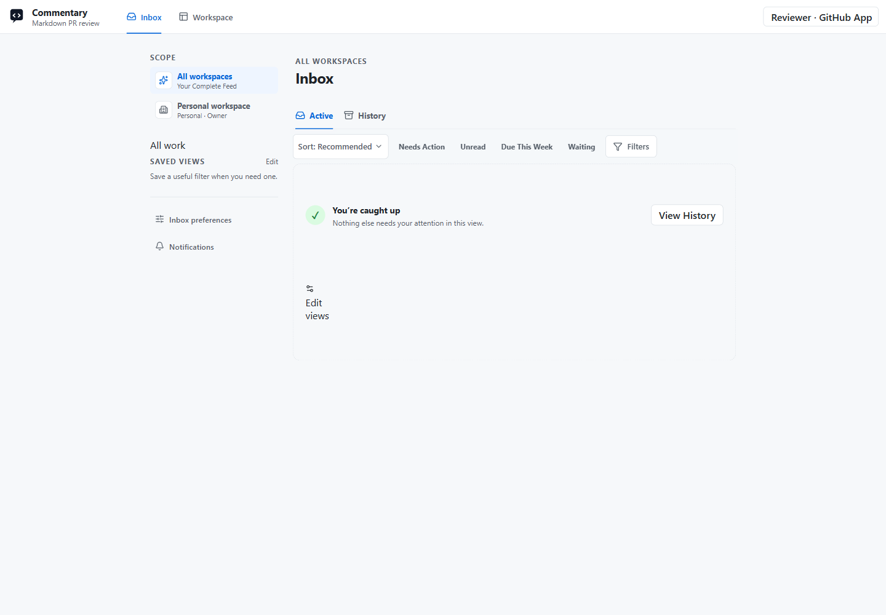

# Agent Inbox

Open [Inbox](https://commentary.dev/inbox) after signing in to see requests and updates across the workspaces you can access. Inbox and Workspace are peer destinations: Inbox is your attention feed; Workspace is where you organize the underlying work.

*Captured on commentary.dev on September 15, 2026. Account identity is anonymized; this account had no active items.*

## Active And History

**Active** combines requests that need you, updates, and work waiting on someone else. **History** contains completed items and items you dismissed. Use **All workspaces** to narrow the feed and **Recommended**, **Newest**, or **Due soon** to change its order. Quick filters include **needs action**, **unread**, **Due this week**, and **waiting**; **Filters** exposes more criteria.

Load older items explicitly. When the selected view has no more work, **You're caught up** is the successful end state. A partial or failed source load does not mean every workspace has been checked.

Workspace membership never replaces permission to the repository or Resource behind an item. Commentary checks access again when you open or act on it. A Resource is the original review, Form, study, Brain, or preview that the request concerns.

## Read And Respond

Each card identifies the sender, workspace, and reason it is in your feed. Open the card's non-action area for the full request, supporting context, related artifact, images when present, and conversation. The focused view keeps its actions available while you scroll. Back or Escape returns to the feed context.

Choose the action that matches your intent:

| Control | Effect |
| --- | --- |
| Requested response, such as an answer, choice, or approval | Responds to the current request. Consequential responses record an exact human Decision. |
| Reply | Adds to this request's conversation without approving it. |
| Teach this agent | Sends guidance for future work without answering or deciding this request. |
| Snooze | Defers the item's visibility and notifications for you. |
| Dismiss | Moves the current event to your History without canceling the underlying work. |
| Postpone, when offered as a requested response | Tells the agent about the postponement; it is separate from personal Snooze. |

Scrolling alone never marks an item read. Deliberately opening it, replying, marking it read, or submitting a requested response does. **Mark unread** explicitly clears read state.

Use **Item options** for Pin, read state, **Attention settings**, **Why this is here**, and **Technical details** when applicable. Priority and due time are personal attention settings; clearing them does not send an agent response. Scheduling shows the applicable time zone and asks you to disambiguate repeated daylight-saving times.

Dismiss offers an eight-second **Undo**, and History provides restoration afterward. A materially newer event can bring dismissed work back to Active. Dismissal affects only your feed, not other recipients or the underlying request.

## Conversation And Agent Guidance

Replies stay in one chronological conversation. **Load older messages** retrieves earlier replies without creating separate feed posts. Eligible authors can use **Edit reply** on their own replies; **Edited** opens retained revision history. Failed sends and edit conflicts retain the draft for recovery. Editing a reply does not rewrite a Decision or an agent's proposal.

For an agent-authored request, open **Item options → Teach this agent**. Choose where the instruction should apply and send future-facing guidance. **Delivered** means Commentary stored it for that agent; **Acknowledged** means the creating agent acknowledged the exact record. Neither status proves the agent has applied it to later work.

## Exact Decisions And Full Review

Only an eligible signed-in person can approve. Read the current proposal, consequence, and requested action before confirming. The receipt binds to that exact revision and action. If the proposal changes, refresh and review the new version; an earlier approval does not authorize a different proposal. Multi-approver requests show remaining approval requirements and your own response separately.

Use full Review when a document, Form, Knowledge Brain, or Live Preview needs anchored comments and revision rounds. Escalation links the exact request revision to a canonical Review Resource. Accepted content or requested corrections return through a new immutable Interaction revision; app-native review threads remain authoritative.

An agent retrieves the receipt and continues through its own tools. **Fulfillment** records the agent's report of receipt, start, completion, failure, or uncertainty. It is not independent proof that an external email, calendar event, or deployment changed.

## Preferences And Availability

Personal settings live under [Inbox settings](https://commentary.dev/settings/inbox) and [Notifications](https://commentary.dev/settings/notifications). See [Saved views and notifications](inbox-preferences.md) and [Teams, agents, and automation](teams-and-agents.md).

Basic Inbox, all-workspaces access, exact Decisions, replies, and future guidance are Core/free capabilities. Explainable attention, saved views, notifications, team routing, multi-approver policies, governance, attention policies, and trust insights have Pro-preview features. These remain usable during the no-billing preview and show the Pro notice where applicable.

For integrations, see [Interaction API](interaction-api.md), [MCP Interactions](mcp-interactions.md), [Agent SDK](agent-sdk.md), [CLI](commentary-cli.md), and [Agent skills](agent-skills.md). Older `/workspace/inbox` links remain compatibility entry points; use `/inbox` for new bookmarks.
