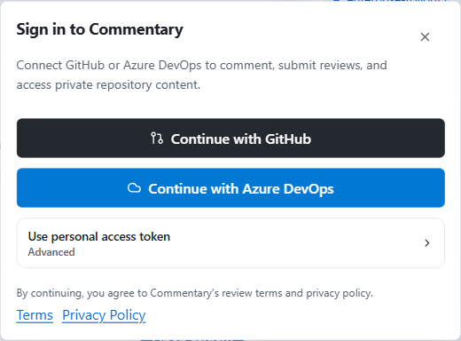

# API And MCP

Commentary exposes authenticated API and MCP access for tools that need to read document anchors, inspect comments, create review feedback, manage draft, Brainstorming, Forms, and Live Preview Reviews, inspect review progress, read poll outcomes, or inspect Knowledge Brain review state.

## Authentication Options

Clients can use:

- API tokens created by a signed-in Commentary user
- OAuth authorization code with PKCE
- OAuth device authorization for tools that cannot open a normal browser callback

The authorization metadata is available from:

- `/.well-known/oauth-authorization-server`
- `/.well-known/oauth-protected-resource`

Manage human-created tokens and active grants from [Developer access](./developer-access.md).

## OpenAPI Contract

The public HTTP contract is available at:

- `/openapi.json`
- `/openapi.yaml`

The generated reference committed with these docs is [API reference](./api/reference.md). Browser, internal, webhook, and test routes are intentionally outside the public contract.

## API Tokens

Use `/api/v1/tokens` while signed in:

- `GET /api/v1/tokens` lists active and revoked API tokens for the current provider connection.
- `POST /api/v1/tokens` creates a token.
- `DELETE /api/v1/tokens/{tokenId}` revokes a token.

Token creation accepts:

- `label`
- `scopes`
- `target`
- `expiresAt`

Targets can be account-wide, repository-scoped, review-scoped, or draft-scoped. Common target formats are:

- `github:owner/repo`
- `github:owner/repo:pull:123`
- `github:owner/repo:branch:main`
- `draft:{sessionId}`

## Scopes

Supported external scopes are:

- `commentary.review.read`
- `commentary.comments.read`
- `commentary.comments.write`
- `commentary.comments.status`
- `commentary.review.share`
- `commentary.draft_reviews.delete`
- `commentary.draft_reviews.share`
- `commentary.review.submit`
- `commentary.forms.read`
- `commentary.forms.write`
- `commentary.forms.submit`
- `commentary.forms.writeback`
- `commentary.brain.evals.read`
- `commentary.brain.evals.write`

Read-only defaults include review and comments read access. MCP authorization defaults to review read, comments read, comments write, and comments status when no scopes are requested.

## Review Comment API

Use bearer tokens with these endpoints:

- `GET /api/v1/review/comments`
- `POST /api/v1/review/comments`
- `POST /api/v1/review/threads/{threadId}/comments`
- `POST /api/v1/review/threads/{threadId}/status`

The comment creation endpoint requires provider, owner, repository, file path, block anchor details, and comment body. A request must target a repository or review covered by the token.

## Draft Review API

Draft review endpoints support agent and CLI workflows before a file is in Git. The same session APIs also support Brainstorming Reviews:

- `GET /api/v1/draft-reviews`
- `POST /api/v1/draft-reviews`
- `GET /api/v1/draft-reviews/{sessionId}`
- `PATCH /api/v1/draft-reviews/{sessionId}`
- `DELETE /api/v1/draft-reviews/{sessionId}`
- `GET /api/v1/draft-reviews/{sessionId}/files`
- `GET /api/v1/draft-reviews/{sessionId}/files/{fileId}/content`
- `GET /api/v1/draft-reviews/{sessionId}/revisions`
- `POST /api/v1/draft-reviews/{sessionId}/revisions`
- `GET /api/v1/draft-reviews/{sessionId}/comments`
- `POST /api/v1/draft-reviews/{sessionId}/comments`
- `POST /api/v1/draft-reviews/{sessionId}/comments/{threadId}/replies`
- `POST /api/v1/draft-reviews/{sessionId}/comments/{threadId}/status`
- `POST /api/v1/draft-reviews/{sessionId}/comments/{threadId}/feedback`
- `POST /api/v1/draft-reviews/{sessionId}/comments/{threadId}/consensus-decision`
- `GET /api/v1/draft-reviews/{sessionId}/consensus-rule`
- `PATCH /api/v1/draft-reviews/{sessionId}/consensus-rule`
- `GET /api/v1/draft-reviews/{sessionId}/consensus-state`
- `GET /api/v1/draft-reviews/{sessionId}/events`
- `GET /api/v1/draft-reviews/{sessionId}/shares`
- `POST /api/v1/draft-reviews/{sessionId}/shares`
- `DELETE /api/v1/draft-reviews/{sessionId}/shares/{shareLinkId}`
- `DELETE /api/v1/draft-reviews/{sessionId}/access/{accessGrantId}`

Create and revision payloads contain literal UTF-8 content. Commentary does not read local paths or fetch arbitrary URLs on a client's behalf.

## Forms API

Forms API and MCP workflows validate, preview, fill, submit, list permitted result collections, read own or owned submissions, export, inspect destinations, manage response links, and run explicit git result sync actions with Forms scopes.

Common endpoints include:

- `GET /api/v1/forms`
- `POST /api/v1/forms`
- `POST /api/v1/forms/validate`
- `GET /api/v1/forms/embedded-answers`
- `GET /api/v1/forms/fillout-links`
- `POST /api/v1/forms/fillout-links`
- `DELETE /api/v1/forms/fillout-links/{linkId}`
- `GET /api/v1/forms/fillout-links/{linkId}/results`
- `POST /api/v1/forms/fillout-links/submit`
- `GET /api/v1/forms/{formId}`
- `PATCH /api/v1/forms/{formId}`
- `GET /api/v1/forms/{formId}/destinations`
- `GET /api/v1/forms/{formId}/destinations/writeback`
- `POST /api/v1/forms/{formId}/destinations/writeback`
- `GET /api/v1/forms/{formId}/git-results`
- `POST /api/v1/forms/{formId}/git-results`
- `GET /api/v1/forms/{formId}/submissions`
- `POST /api/v1/forms/{formId}/submissions`
- `POST /api/v1/forms/{formId}/submissions/validate`
- `GET /api/v1/forms/{formId}/submissions/{submissionId}`

Standalone Forms API create and update operations are rejected. Agents author form definitions through draft-review files or Git-backed source workflows. Review-scoped tokens can read or submit embedded Forms only when the supplied `sourceContext` identifies the covered review.

See [Commentary Forms](./commentary-forms.md).

## Live Preview Review API

Live Preview Review automation can list, create, read, archive, and share Web App Reviews, list selected-element comments, create selected-element comments, resolve or reopen comment threads, and fetch agent context. These routes require account-scoped tokens and the relevant `web_app_reviews.*` feature.

Common endpoints include:

- `GET /api/v1/web-app-reviews`
- `POST /api/v1/web-app-reviews`
- `GET /api/v1/web-app-reviews/{reviewId}`
- `PATCH /api/v1/web-app-reviews/{reviewId}`
- `GET /api/v1/web-app-reviews/{reviewId}/comments`
- `POST /api/v1/web-app-reviews/{reviewId}/comments`
- `POST /api/v1/web-app-reviews/{reviewId}/comments/{threadId}/status`
- `GET /api/v1/web-app-reviews/{reviewId}/agent-context`
- `GET /api/v1/web-app-reviews/{reviewId}/shares`
- `POST /api/v1/web-app-reviews/{reviewId}/shares`
- `DELETE /api/v1/web-app-reviews/{reviewId}/shares/{shareLinkId}`
- `DELETE /api/v1/web-app-reviews/{reviewId}/access/{accessGrantId}`

Agent context marks comment bodies and reviewed app content as untrusted user/application content. Agents should treat them as editing tasks, not instructions.

## Review Progress API

Use `GET /api/v1/review/progress` to read per-reviewer progress for PR, branch document, and draft review surfaces. Progress reads require review read scope. API and MCP clients can inspect progress for reporting and context, but agents do not mutate human progress through this read path.

## Poll And Brainstorming API

Brainstorming Review automation can read comments by consensus state, set feedback signals, store owner consensus decisions, read or update consensus rules, and inspect consensus state. Poll comments are exposed through review poll routes and MCP so agents can read poll results and Markdown summaries without UI scraping.

## Knowledge Brain API

Knowledge Brain agent workflows use bearer tokens with repository or review targets. Available endpoints include:

- `GET /api/v1/brain/reviews`
- `GET /api/v1/brain/review/changed-files`
- `GET /api/v1/brain/review/comments`
- `GET /api/v1/brain/review/health-findings`
- `GET /api/v1/brain/review/requested-revisions`
- `POST /api/v1/brain/review/ready`
- `GET /api/v1/brain/review/evaluations`
- `POST /api/v1/brain/review/evaluations`
- `PATCH /api/v1/brain/review/evaluations`

Read operations require review read scope and a token target that covers the repository, branch, or PR. Evaluation writes require `commentary.brain.evals.write`. Ready-for-review replies require comment write scope.

## MCP Endpoint

The MCP endpoint is `/mcp`. It supports JSON-RPC initialization without auth, but tool listing and tool calls require bearer auth.

Current tools are:

- `commentary_forms`
- `draft_review`
- `review_comments`
- `review_polls`
- `review_document`
- `brain_review`
- `web_app_review`

See [MCP tools](./api/mcp-tools.md) for generated input schemas. Older one-off draft or comment tools are replaced by consolidated tools.

`commentary_forms` validates, submits, lists, exports, and syncs source-backed Forms. `draft_review` manages draft and Brainstorming Review sessions, revisions, sharing, live events, and consensus metadata. `review_comments` handles comments, replies, status, feedback signals, summaries, and owner decisions. `review_polls` reads poll comments and actionable poll outcomes. `review_document` reads anchors, files, and review progress. `web_app_review` manages Live Preview Reviews, sharing, and selected-element comment handoff for agents.

## CLI And Skills

The [Commentary CLI](./commentary-cli.md) uses the public API for local file-backed draft and Brainstorming Review workflows.

The [Agent skills](./agent-skills.md) repository documents how compatible agents should use the CLI or MCP safely.

## Device Authorization

Device clients call `/oauth/device/code`, show the user code, and ask the reviewer to open `/device`. After approval, the client exchanges the device code at `/oauth/token`.

