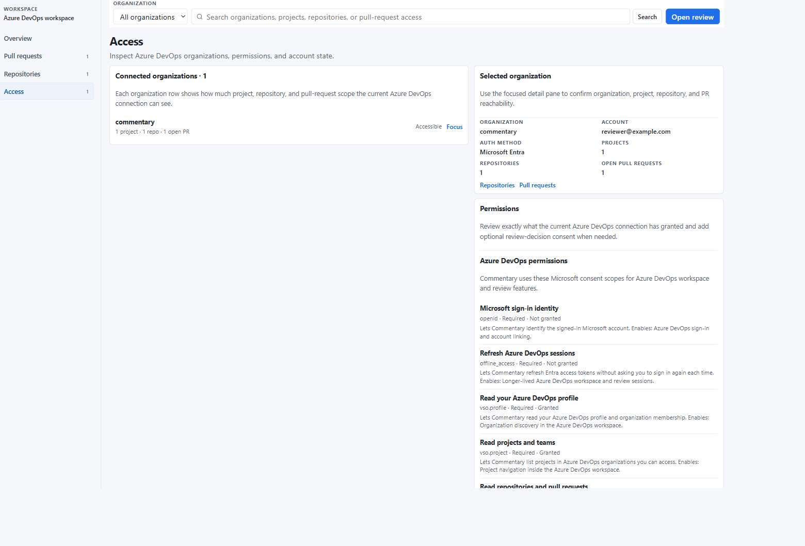
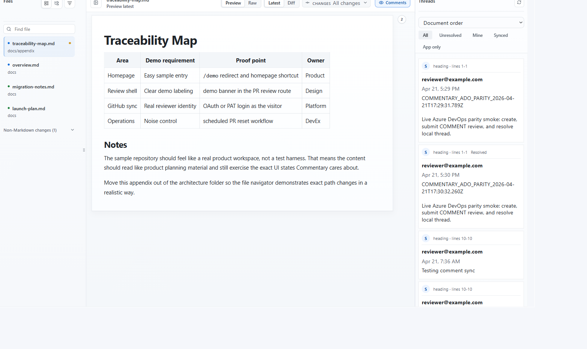

# Azure DevOps

Commentary supports Azure DevOps pull request review and direct document review.

## Open Azure DevOps Content

Paste an Azure DevOps PR, repository, branch, folder, or Markdown file URL into the homepage or workspace `Open review` control. Project-scoped URLs are preferred because they identify the organization, project, and repository unambiguously.

## Sign In

Use `Continue with Azure DevOps` for the default Microsoft Entra flow. Use the Azure DevOps PAT option only when Entra sign-in is not available.

## Workspace

The Azure DevOps workspace shows:

- accessible organizations
- projects and repositories
- active pull requests
- recent Commentary review sessions
- current permission state

The access page shows which Microsoft scopes are granted and whether optional review-decision consent is available.

## Pull Request Review

Azure DevOps PR review uses the same document-first shell as GitHub.

In a PR review, you can:

- read rendered Markdown
- switch to raw source
- inspect latest or diff scope
- use all-change and commit-specific change sets
- comment, reply, resolve, and reopen threads when authenticated
- submit the provider review event when ready

## Direct Document Review

Direct document review opens repository Markdown by branch, folder, or file.

Document review comments stay in Commentary and do not submit an Azure DevOps review event.

## Permission Notes

Azure DevOps access depends on the connected account and the scopes granted during Microsoft consent. If a route cannot load content, check the workspace access page first.
