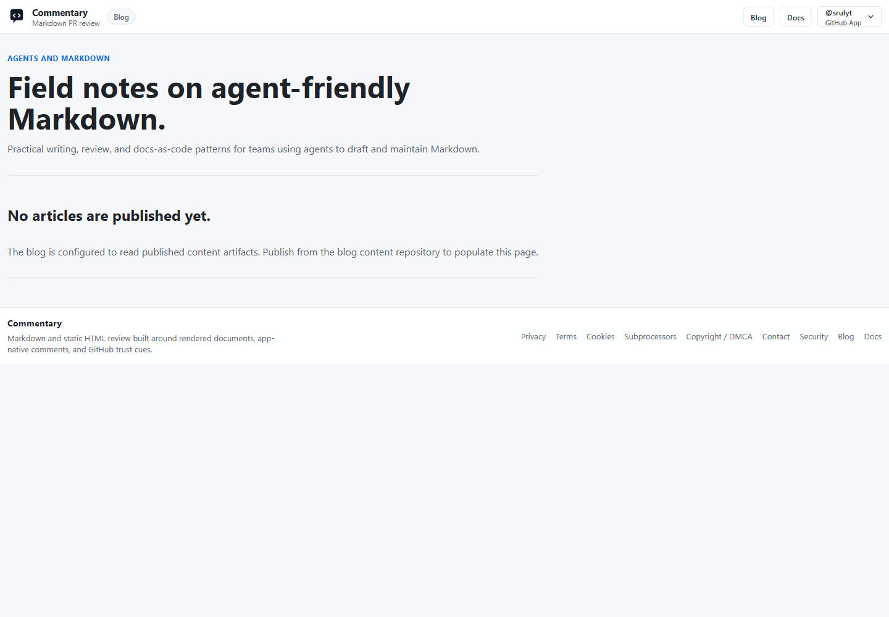

# Blog

The public blog lives at [/blog](https://commentary.dev/blog). It is for field notes on agents, Markdown, docs-as-code, and document review.

## What Appears There

The blog reads published content artifacts. When no posts are published, the page shows an empty state instead of a broken route.

Published posts include title, description, author, publish date, reading time, tags, and a canonical URL. The blog also exposes RSS at `/blog/rss.xml`.

## Who Uses It

Use the blog for public product education and practical writing or review patterns. Product workflow documentation remains in these docs, especially [Getting started](./getting-started.md), [Draft reviews](./draft-reviews.md), and [API and MCP](./api-and-mcp.md).
