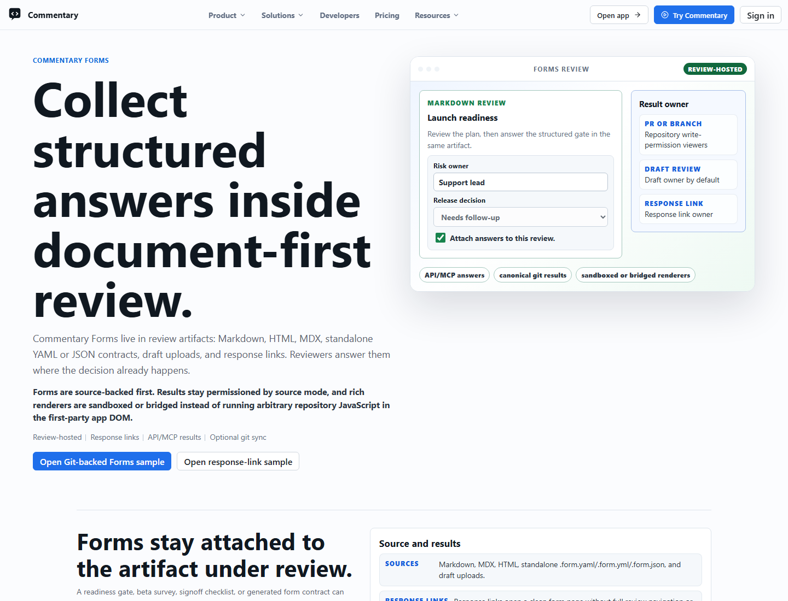
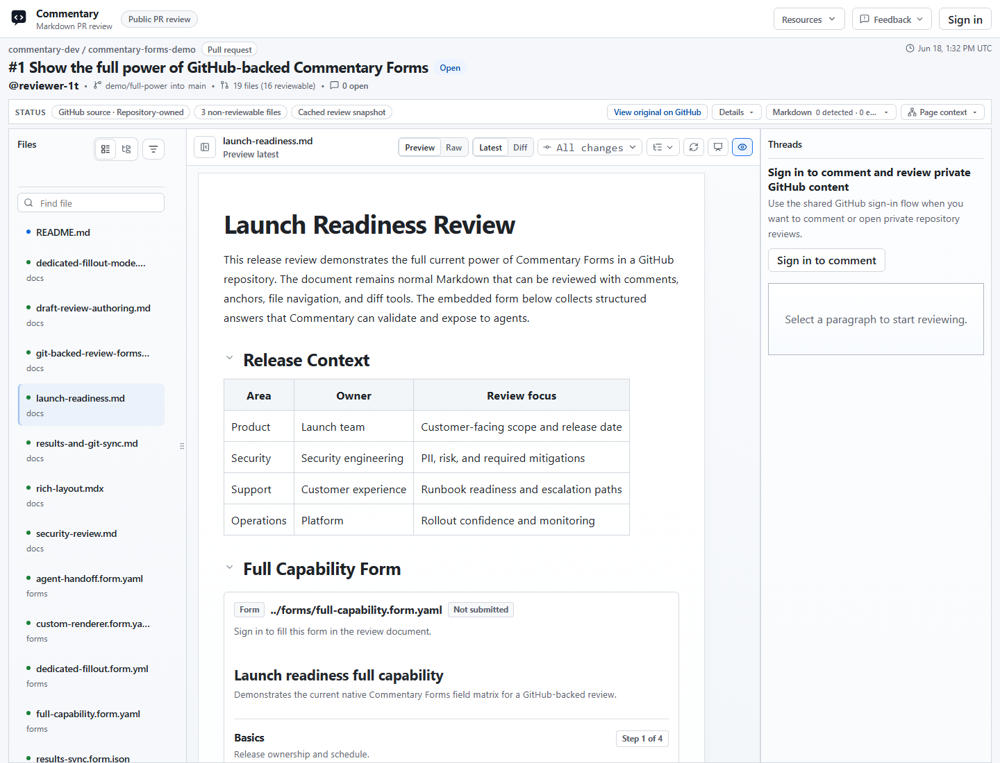

# Commentary Forms



Commentary Forms collect structured answers inside the document-review workflow. They are separate from review comments and poll comments: threads remain the place for discussion, polls stay attached to a thread, and Forms own structured values, validation results, source context, exports, result links, git result sync, and agent handoff.

Use Forms when a review needs repeatable structured input, such as release readiness, security triage, migration checklists, customer intake, launch sign-off, evaluation rubrics, or agent-readable handoff.



## Source Model

Forms are source-authored. The workspace manages discovered sources and results, but it is not the primary form editor.

Form definitions can come from:

- standalone `forms/*.form.yaml`, `forms/*.form.yml`, or `forms/*.form.json` review artifacts
- Markdown or MDX files that embed a form block
- static HTML files with sanitized form bindings
- draft or Brainstorming Review uploads
- GitHub-backed repository files read through existing read-only repository access
- dedicated response links created from an existing review-hosted form
- custom Live Preview Review renderers that submit structured values through the Forms SDK bridge

Standalone YAML and JSON form files open as fillable review artifacts with the native renderer and still keep `Raw` mode available for source inspection.

## Form Contract V1

The contract source can be YAML or JSON. Commentary normalizes both into canonical JSON before validation, persistence, rendering, API responses, MCP responses, exports, and writeback.

Minimal YAML:

```yaml
commentaryForm: 1
id: security-review
title: Security review
description: Structured security review checklist.
schema:
  type: object
  additionalProperties: false
  required:
    - reviewer
    - riskLevel
  properties:
    reviewer:
      type: string
      title: Reviewer
      fieldKind: text
      minLength: 2
      maxLength: 80
    riskLevel:
      type: string
      title: Risk level
      fieldKind: select
      enum:
        - low
        - medium
        - high
    findings:
      type: string
      title: Findings
      fieldKind: textarea
      maxLength: 4000
submit:
  destinations:
    - kind: commentary
      enabled: true
```

Supported contract pieces include:

- `commentaryForm: 1`
- a bounded JSON Schema subset for objects, primitives, arrays, enums, scalar limits, patterns, and required fields
- `ui.fields`, `ui.sections`, `ui.pages`, `ui.groups`, and `ui.reviewPage` for native rendering
- safe declarative logic for conditional UI and requirements
- JSON, YAML, and CSV exports for scalar or scalar-array values

Server validation is authoritative. Client validation is only a usability layer.

## Filling And Submitting

Review-hosted forms follow review access and require sign-in by default. Public read-only review access does not permit anonymous form submission.

Dedicated response links are explicit share records created by an owner from an existing form source. A response link can be authenticated or anonymous, can store identified or anonymous replies, and can be revoked. Anonymous response-link replies intentionally omit viewer id, provider account id, and login fields.

Repeat submissions are allowed by default unless the source or link configuration says otherwise.

## Results And Ownership

Result-list access is separate from fill access.

- Draft review form result lists are visible to the draft owner by default.
- PR and branch result lists require a trusted source write-permission check.
- Dedicated response-link result lists belong to the response-link owner by default.
- Submitters can read their own individual submission detail when allowed, but that does not grant broad result-list access.
- Result-share links can expose read-only result collections to anonymous, authenticated, or specific-people audiences.

Exports preserve source context without expanding usage telemetry. Stored submitted values are product data, not analytics events.

## Markdown And HTML Forms

Markdown and MDX can embed Forms while preserving review anchors, comments, polls, and completion state. Static HTML can bind sanitized controls through `data-commentary-field` metadata and the parent-frame bridge.

HTML bindings do not trust form `action`, inline handlers, or customer script. Static HTML review remains sandboxed: scripts, event handlers, dangerous URLs, and active embeds stay blocked.

## API, MCP, And CLI

Forms automation uses explicit scopes:

- `commentary.forms.read`
- `commentary.forms.write`
- `commentary.forms.submit`
- `commentary.forms.writeback`

Review-scoped tokens can read or submit embedded Forms only when the supplied `sourceContext` identifies the covered review. API and MCP clients send literal contract objects or literal JSON/YAML strings. Commentary does not read local file paths or fetch arbitrary URLs from agent arguments.

The consolidated MCP tool is `commentary_forms`. It can validate contracts, validate answers, submit forms, manage response links, list permitted result collections, read own or owned submissions, export submissions, inspect destinations, and run explicit git result sync actions.

Standalone Forms API create and update operations are rejected. Agents author forms through draft-review files or Git-backed source workflows instead of creating a separate workspace-only form.

See [API and MCP](./api-and-mcp.md), [API reference](./api/reference.md), and [MCP tools](./api/mcp-tools.md).

## GitHub Writeback And Git Results

Forms work without GitHub writeback. Definitions and submissions can stay in Commentary storage, render in review surfaces, remain available to API/MCP clients, and export as JSON, YAML, or CSV.

Optional GitHub writeback uses a separate write-capable GitHub App. The default GitHub App remains read-only for repository contents.

Authorized API/MCP clients can explicitly:

- preview the canonical writeback path and payload
- write one final submission as canonical JSON
- list canonical git-hosted result files
- import valid result files
- inspect sync status and diagnostics

Canonical result files use:

```text
<form-directory>/results/<form-file-stem>/<submission-or-external-id>.result.json
```

For `forms/security-review.form.yaml` and submission `sub_123`, the path is:

```text
forms/results/security-review/sub_123.result.json
```

Malformed git result files are returned as diagnostics instead of crashing sync.

## Custom Renderers

Live Preview apps can render customer-owned form UI while Commentary keeps the Form Contract, validation, submissions, and agent-readable results authoritative. Custom renderers submit structured values through `@commentary-dev/forms-sdk` or the Commentary Forms SDK CDN inside an existing Live Preview Review iframe.

The bridge is nonce-bound, origin-aware, iframe-window-aware, and size-limited. Commentary does not fetch renderer URLs server-side and does not execute customer JavaScript inside Commentary.

## Feature Tiers

- `forms.basic`: Commentary Forms, native rendering, signed-in human submissions, and submission views. Free.
- `forms.embedded_reviews`: Forms embedded in Markdown, HTML, draft reviews, and review surfaces. Free.
- `forms.agent_api`: API, MCP, and CLI Forms workflows. Free.
- `forms.github_source`: GitHub-backed form definitions through existing read-only access. Free.
- `forms.custom_renderer`: Custom renderer bridge for Live Preview Reviews. Pro preview.
- `forms.github_writeback`: Optional GitHub writeback through the separate write-capable app. Pro preview.

During the no-billing preview period, Pro-preview features remain usable and show the standard Pro notice when accessed.

## Demos

Open [/demo/select](https://commentary.dev/demo/select) and choose the Forms samples. Current demo paths include:

- `/demo/commentary-forms`
- `/demo/forms-git-backed`
- `/demo/forms-draft-authoring`
- `/demo/forms-response-link`
- `/demo/forms-results-sync`
