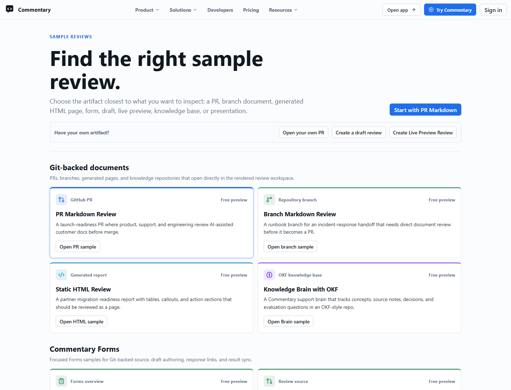

# Demo Walkthrough

The fastest way to understand Commentary is to open the built-in sample chooser at [/demo/select](https://commentary.dev/demo/select). The older `/demo` route still opens a guided sample, but `/demo/select` shows the current set of review workflows.

## What The Demo Shows

- a realistic Markdown PR review
- branch Markdown review
- static HTML review
- split Commentary Forms samples
- Draft Review and Brainstorming Review samples
- Knowledge Brain with OKF-shaped content
- Live Preview Review samples
- presentation-mode and Marp samples
- the document-first review shell
- rendered `Preview` mode as the default surface
- `Latest` and `Diff` review modes
- file navigation, heading folding, progress, and thread rail behavior
- sign-in prompts before write actions

## How To Explore It

1. Open [/demo/select](https://commentary.dev/demo/select).
2. Choose a sample that matches the workflow you want to evaluate.
3. Read the first file in `Preview` and `Latest`.
4. Switch files in the navigator.
5. Try `Diff`, heading folding, and the change-set menu when available.
6. Open the comments rail.
7. Sign in if you want to try authenticated comment, form submission, share, or submit-review behavior.

## Forms Samples

The Forms group includes source-backed and result-oriented demos:

- `/demo/commentary-forms`
- `/demo/forms-git-backed`
- `/demo/forms-draft-authoring`
- `/demo/forms-response-link`
- `/demo/forms-results-sync`

Use them to see native form rendering, draft authoring, response links, and result handoff without pointing visitors at mutable test repositories.

## What The Demo Is Good For

- validating the reading experience before onboarding a team
- showing stakeholders what document-first review means
- learning the review shell before opening your own repository
- comparing Markdown, HTML, Forms, Knowledge Brain, Draft, Brainstorming, and Live Preview workflows

## What The Demo Is Not

- it is not your repository
- it is not a private review space
- it is not a mutable writeback target for normal visitors
- it is not the same as direct document review

For repository docs outside a PR, paste a branch, folder, file, or repository URL from the homepage.
