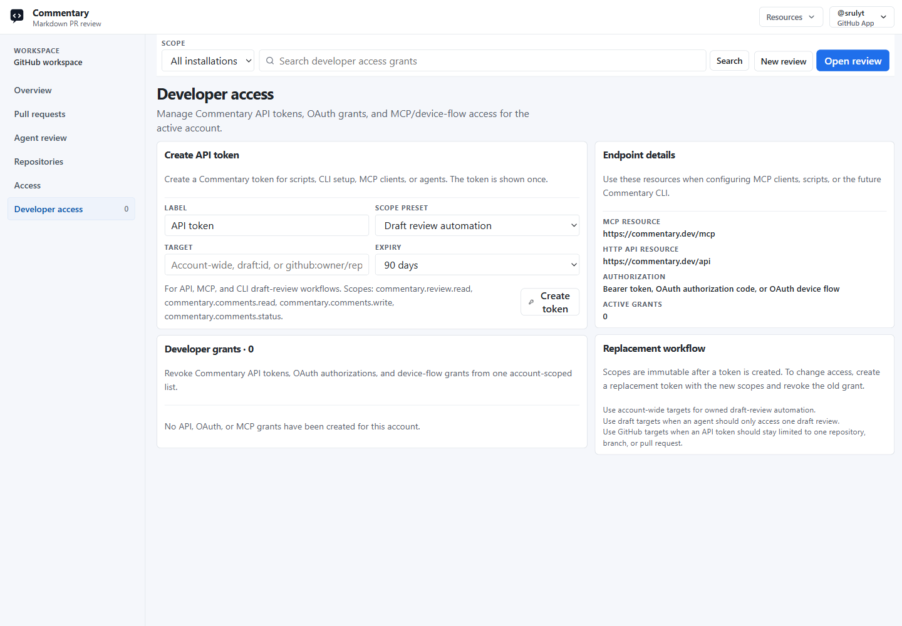

# Developer Access

Developer access is the signed-in workspace area for managing Commentary credentials used by scripts, API clients, MCP clients, CLIs, and agents.

Open [/workspace/developer](https://commentary.dev/workspace/developer) after signing in.

## What You Can Manage

Developer access shows and manages:

- API tokens created by the signed-in account
- OAuth authorization grants
- OAuth device-flow grants used by terminal and MCP clients
- active, expired, and revoked grant state

New API tokens are shown once. Copy the token before leaving the page. Later lists only show the token hint.

## Create An API Token

1. Open `Workspace`.
2. Choose `Developer access`.
3. Enter a label.
4. Choose a scope preset.
5. Set a target when you want to restrict access.
6. Choose an expiry.
7. Click `Create token` and copy the token.

Scopes are immutable after creation. To change access, create a replacement token and revoke the old grant.

## Scope Presets

Developer access offers common presets:

- `Read reviews and comments` for tools that inspect review sessions and comments.
- `Draft review automation` for API, MCP, and CLI draft-review workflows.
- `Draft review deletion` for trusted cleanup tools.
- `Review and submit` for trusted tools that can submit provider review decisions.
- `Brain evaluations` for agents that submit or read Knowledge Brain evaluations.

The generated token stores the concrete scope names, such as `commentary.review.read`, `commentary.comments.write`, or `commentary.draft_reviews.share`.

## Targets

Targets limit where a token can operate.

Common target formats are:

- account-wide: leave the target blank
- repository: `github:owner/repo`
- pull request: `github:owner/repo:pull:123`
- branch: `github:owner/repo:branch:main`
- draft review: `draft:{sessionId}`

Use account-wide targets for owned draft-review automation. Use draft targets when an agent should only access one draft review. Use GitHub targets when a token should stay limited to one repository, branch, or pull request.

## MCP And Device Flow

MCP clients can use the `/mcp` endpoint with bearer authentication. Device-flow clients start at `/oauth/device/code`, show the user code, ask the reviewer to open `/device`, and exchange the approved device code at `/oauth/token`.

The developer access page lists device-flow and OAuth grants so they can be revoked from the same place as API tokens.

## Revoking Access

Use `Revoke` on an active grant when a token or client should stop working. Revocation affects API, OAuth, and MCP use immediately for that grant.

See [API and MCP](./api-and-mcp.md) for endpoint details.
