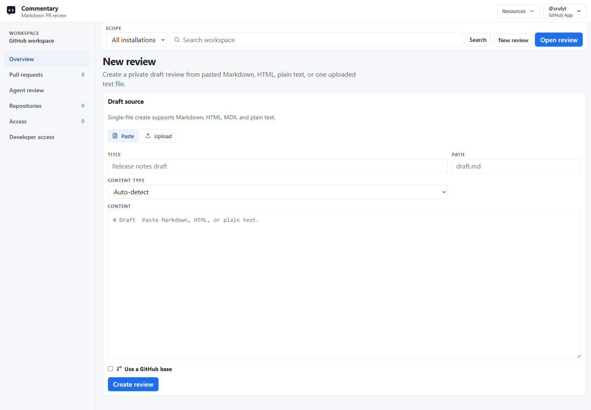

# Draft Reviews

Draft reviews let signed-in users review Markdown, MDX, static HTML, plain text, Form Contracts, and supported visual artifacts before the content exists in a Git branch or pull request.

Open [/workspace/drafts/new](https://commentary.dev/workspace/drafts/new) to start a private draft review.



## Create A Draft Review

1. Sign in to Commentary.
2. Select the destination Workspace and open **New review → Document review**.
3. Choose `Paste` or `Upload`.
4. Add a title.
5. Paste supported text content or upload a supported document, Form Contract, image, SVG, or Mermaid source.
6. Click `Create review`.

Pasted content can be auto-detected or explicitly marked as Markdown, HTML, or plain text. Text upload accepts `.md`, `.markdown`, `.mdx`, `.html`, `.htm`, and `.txt`; supported Form Contract and visual formats are also available. See [Images and diagram reviews](visual-reviews.md) for formats, upload limits, region comments, and agent upload flow.

## Optional GitHub Base

Use `Use a GitHub base` when a local draft is related to an existing GitHub file, branch, or commit. Commentary stores owner, repository, ref, sha, and path metadata so agents and tools can compare draft revisions to a GitHub source and update the base later.

A GitHub base does not create a branch, open a pull request, or grant repository write access.

## Review The Draft

Draft review pages use the same document-first review shell as Git-backed reviews:

- `Preview` renders the document for reading.
- `Raw` shows the source.
- Comments attach to semantic blocks and selected text.
- Comment bodies can render safe Markdown, including code snippets and structured lists.
- Replies, resolve, reopen, and filters behave like ordinary review threads.
- Previous revisions remain readable but are read-only for new comments.

Draft comments stay in Commentary. They do not sync to GitHub or Azure DevOps provider reviews.

## Revisions And Live Updates

Use `Upload new revision` to paste or upload replacement content. API, MCP, CLI, and agent clients can also create an empty draft first and upload the first revision later.

Revision uploads can be partial. If a tool uploads only changed files, Commentary carries omitted files forward into the new immutable revision.

Open draft pages listen for live comment, reply, status, revision, rebase, and deletion events. The `Live` control can pause or resume updates. Current Document pages refresh when a new revision arrives, while pinned previous-revision views stay on the selected revision.

## Draft Actions

Use `Draft actions` from the review toolbar to:

- copy the review link
- copy the session id
- copy agent instructions
- share the draft review
- download the latest file
- change the GitHub base
- delete the draft review
- convert the draft to a Brainstorming Review when the review should become a plan-of-record workflow

Agent instructions are meant for coding agents or CLIs that are updating local files. Commentary expects the client to read local files and send literal content; it does not read local paths or fetch arbitrary URLs for the agent.

## Commentary CLI

Use the [Commentary CLI](./commentary-cli.md) when a local file or directory is the editing surface.

Common commands:

```bash
commentary review ./docs/spec.md --title "Product spec"
commentary sync --message "Address review comments"
commentary comments --format markdown --open
commentary next-comment --timeout 60s --json
commentary share --anyone
commentary restore <session-id>
```

The CLI writes local review metadata to `.commentary/session.json`, but it does not store auth tokens there.

## Brainstorming Reviews

Brainstorming Reviews use the same draft review routes and revision model, but add feedback signals, consensus rules, decision polls, and agent-ready accepted-change workflows.

Create one from the draft review form by choosing `Brainstorming review`, or convert an existing draft from `Draft actions`.

See [Brainstorming Reviews](./brainstorming-reviews.md).

## Sharing

Owners can create share links from `Draft actions`.

- Anyone-link sharing gives signed-in users access after they open the share URL.
- User-link sharing can target a GitHub username or email when Commentary can resolve the recipient.
- Owners can revoke links and remove claimed access grants.
- Shared viewers can comment, reply, and resolve when allowed, but cannot upload revisions, rebase, delete, reshare, or see hidden Git base metadata.

Shared draft URLs use `/review/draft/share/{token}` and still require sign-in before private content is shown.

## API And MCP Use

Draft review automation is available through the public API and MCP:

- HTTP endpoints under `/api/v1/draft-reviews`
- the `draft_review`, `review_comments`, and `review_document` MCP tools
- scoped API tokens from [Developer access](./developer-access.md)
- CLI and agent workflows that send literal file content through the same API boundary

See [API and MCP](./api-and-mcp.md), [API reference](./api/reference.md), and [MCP tools](./api/mcp-tools.md).

## What Draft Reviews Do Not Do

Draft reviews do not publish content to GitHub, create branches, commit files, open pull requests, or post provider review comments. Download or apply the latest content locally, then commit and push with your own Git credentials when the draft is ready.

Deleted drafts disappear from review pages, workspace lists, API responses, MCP reads, and live update streams immediately. Active Commentary storage, including uploaded or pasted raw/rendered draft artifacts, is purged within 24 hours. Provider systems, local checkouts, and platform backups have separate retention behavior.
