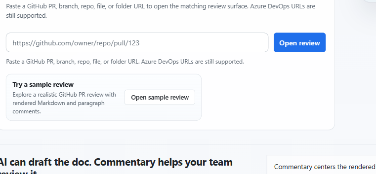

# Getting Started

Use Commentary when you want to review Markdown, MDX, static HTML, structured Forms, draft text, or a running app preview as readable review context instead of parsing changed lines.

## Fastest First Run

1. Open [/](https://commentary.dev/).
2. Paste a GitHub or Azure DevOps URL.
3. Click `Open review`.
4. Start in `Preview` and `Document`.
5. Sign in only when you need to comment, reply, refresh private content, submit a review, create or share drafts, manage Forms, create Live Preview Reviews, or use developer access.

Commentary accepts pull request, repository, branch, file, and folder URLs. It resolves the URL to the matching review surface for Markdown, MDX, static `.html` or `.htm` documents, and standalone Form Contract files.

## What Works Before You Sign In

- Public GitHub pull requests can open read-only.
- You can read rendered Markdown, inspect raw Markdown, and move through files when public data is available.
- You can review static HTML previews and standalone form definitions when public files are available.
- You can open public demo samples from [/demo/select](https://commentary.dev/demo/select).
- Commentary keeps the document centered so prose reads like a spec, ADR, README, form-backed checklist, or rollout plan.

## When You Need An Account

Sign in when you want to:

- add a new thread
- reply to a thread
- resolve or reopen a thread
- submit a pull request review
- open private repositories
- create or share draft reviews
- create or share Brainstorming Reviews
- fill review-hosted Forms or manage Forms results and response links
- create Live Preview Reviews for deployed or localhost preview apps
- create deployed Live Preview Review share links
- use the GitHub or Azure DevOps workspace
- create API tokens, use the Commentary CLI, connect an MCP client, or authorize an agent

GitHub App is the default GitHub path. Azure DevOps uses Microsoft Entra by default. PAT options remain available for restricted environments.

## Two Good Ways To Explore

- Want a safe sandbox: open [/demo/select](https://commentary.dev/demo/select) and follow [Demo walkthrough](./demo-walkthrough.md).
- Want to review docs before a PR exists: paste a repository, branch, file, or folder URL and read [Review repository branches](./review-repository-branches.md).
- Want to collect structured answers: read [Commentary Forms](./commentary-forms.md).
- Want to review a local or agent-generated draft before it is in Git: open [Draft reviews](./draft-reviews.md).
- Want a group to converge on a plan before implementation: read [Brainstorming Reviews](./brainstorming-reviews.md).
- Want to review a running UI preview: read [Live Preview Reviews](./web-app-reviews.md).
- Want to create or sync draft reviews from a terminal: read [Commentary CLI](./commentary-cli.md).
- Want an agent to participate in the review loop: read [Agent skills](./agent-skills.md).
- Want to track what you have already reviewed: read [Review progress](./review-progress.md).
- Want to review generated docs or site content: read [Markdown extensions](./markdown-extensions.md) and [Static HTML review](./static-html-review.md).
- Want to review AI-maintained knowledge bases or OKF bundles: read [Knowledge Brain](./knowledge-brain.md).

For team queue work, open the [Workspace](./workspace.md) after signing in.
