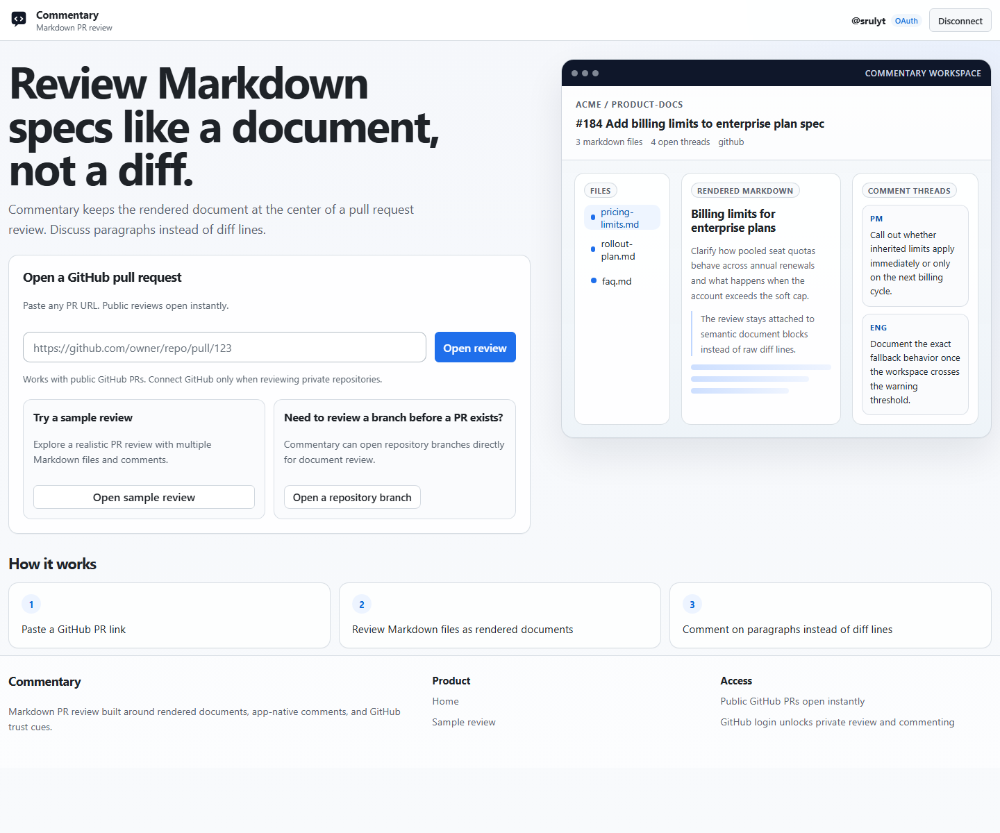

# Getting Started

Use Commentary when you want to review Markdown as a readable document instead of parsing GitHub diff lines.

## Fastest First Run

1. Open [/](https://commentary.dev/).
2. Paste a public GitHub pull request URL.
3. Click `Open review`.
4. Read the document in `Preview` and `Latest` first.
5. If you want to add a comment or reply, click `Sign in`.

## What Happens Before You Sign In

- Public pull requests load in read-only mode.
- You can switch files, change between `Preview` and `Raw`, and move between `Latest` and `Diff`.
- Commentary keeps the rendered document front and center, so you can read the change like a spec instead of like code.

## When You Need GitHub Access

You need GitHub access when you want to:

- add a new thread
- reply to an existing thread
- review private repositories
- use `Submit review` on a pull request

OAuth is the default path. If your environment does not allow OAuth, use the advanced `Use PAT` flow described in [Access and authentication](./access-and-authentication.md).

## Two Good Ways To Explore

- Want a safe sandbox: open [/demo](https://commentary.dev/demo) and follow [Demo walkthrough](./demo-walkthrough.md).
- Want to review docs before a PR exists: use the homepage repository path and click `Open docs`, then read [Review repository branches](./review-repository-branches.md).

The homepage keeps the main PR intake dominant and nests direct repository review under the secondary `Open docs` path.
