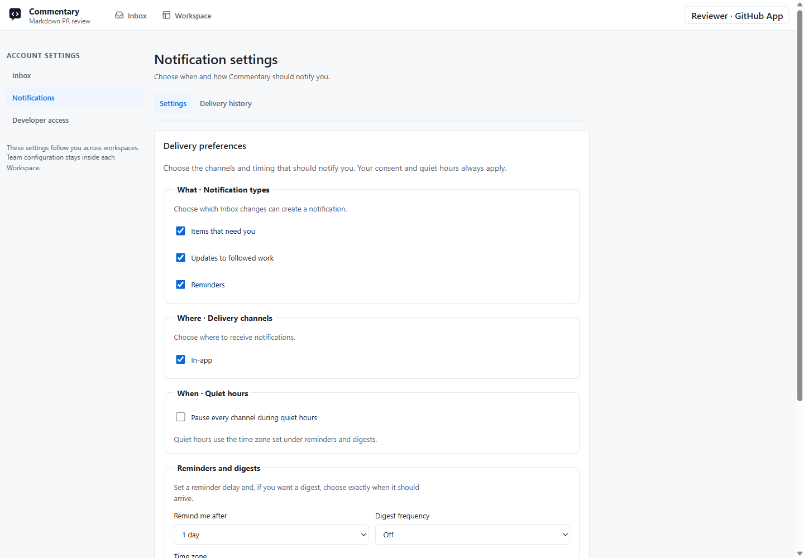

# Saved Views And Notifications

Account settings follow you across workspaces. Team configuration stays in the selected [Workspace](workspace.md).

## Save An Inbox View

Open [Inbox settings](https://commentary.dev/settings/inbox). Create a view from a starter, name it, and choose the filters and ordering you need. Common criteria cover workspaces, request state, Resource type, unread/pinned state, priority, deadlines, and assignment to you. Advanced filters expose additional source and agent criteria.

Views are private. They apply before pagination and still check your current access to each item. Editing a name or collapsing Advanced filters retains the other saved criteria. Remove a criterion deliberately when you no longer want it.

You can make a view your default. Only a plain `/inbox` visit applies that default automatically. Explicit filter links retain their choices; `/inbox?view=all` bypasses the default. Deleting the default restores the ordinary Inbox. Invalid or inaccessible saved-view links explain the fallback.

Registered agents can propose a view, but only its human owner can accept it. Proposals do not silently change your feed. Saved views are typed filters, not scripts or provider query languages.

## Configure Notifications

Open [Notification settings](https://commentary.dev/settings/notifications).

*Captured on commentary.dev on September 15, 2026 with account identity anonymized. This deployment exposed only In-app delivery.*

1. Choose **What**: items that need you, updates to followed work, and reminders.
2. Choose **Where**: In-app and any external channels enabled by the deployment.
3. Set **When**: quiet hours, reminder delay, digest frequency, and time zone.
4. Save settings before using **Send test**.

Email and Web Push require deployment support and explicit consent. They start disabled. An unavailable channel is not offered as a working control; stored preferences are retained if it becomes unavailable later. Browser push permission alone does not confirm delivery.

Digest frequency is **Off**, **Daily**, or **Weekly**. Daily asks for a time; Weekly asks for a weekday and time. Off retains the prior schedule without sending a digest. The displayed IANA time zone governs delivery and quiet hours, including daylight-saving changes. Snoozed Inbox work also defers its notifications.

## Inspect Delivery History

[Delivery history](https://commentary.dev/settings/notifications/history) is separate from configuration. It shows queued tests, delivery attempts, retries, and failures, with explicit older-page navigation. **Queued** means accepted for processing; it does not mean **Delivered**.

Titles and destinations are checked against current access. A deleted or inaccessible request uses a generic delivery label and safe Inbox recovery. Delivery records are retained for 30 days.

Digest links open a summary of the original requests. Each child remains independently actionable, and opening one keeps the digest context for Back navigation. Notifications never approve, reject, or execute an action: sign in and review the current request in Commentary.

## Availability

Saved views (`inbox.saved_views`) and notifications (`inbox.notifications`) are Pro-preview capabilities, usable during the current no-billing phase. See [Agent Inbox](agent-inbox.md) for personal read, pin, snooze, dismissal, and due-date controls.
