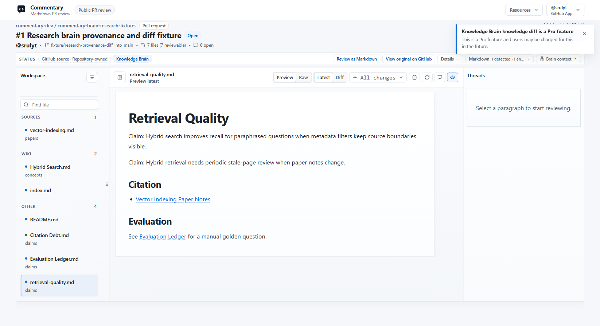
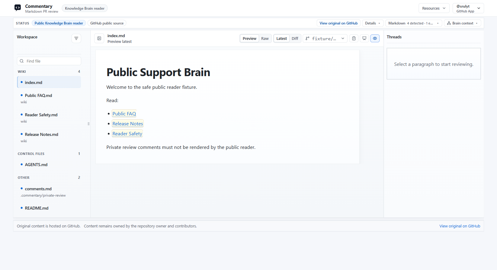

# Knowledge Brain

Knowledge Brain mode is for reviewing AI-maintained knowledge bases before they are merged or published.

## When To Use It

Use Knowledge Brain review when a branch updates source notes, generated wiki pages, project memory, research claims, LLM outputs, or other knowledge-base files. Commentary keeps the work in the normal rendered document review shell, but adds brain-aware navigation and review context.

Common patterns include:

- LLM wikis with raw source notes, wiki pages, and generated briefs
- research brains with papers, concepts, claims, citations, and evaluation ledgers
- project brains with architecture notes, ADRs, incidents, and runbooks
- agent-maintained support or product knowledge bases

## Brain Workspace

When Knowledge Brain mode is active, the file navigator groups files by role instead of showing only a flat Markdown list. Typical groups include sources, wiki pages, outputs, and other control or support files.

Brain review can add:

- review summaries for changed knowledge
- wikilinks and backlinks between pages
- source-to-wiki comparison context
- health findings for broken links, missing source trails, duplicate entities, risky content, and schema issues
- provenance views for claims and their source references
- knowledge-diff and graph-review context for relationship changes
- evaluations for manual golden-question checks

Some advanced Brain surfaces are Pro preview features. They remain usable during the preview period and show the standard Pro notice when opened.

## Public Readers

Published public Brain readers expose a read-only document view for public repositories or public snapshots.

Reader pages keep repository ownership visible and link back to the original source. App-native review comments and private review data are not rendered in public reader pages.

Private Brain publishing is a Pro preview feature and requires sign-in before private content is rendered.

## API And Agent Workflows

API and MCP clients can inspect Knowledge Brain review state with scoped tokens. Supported workflows include listing Brain reviews, changed Brain files, review comments, health findings, requested revisions, ready-for-review replies, and evaluation ledgers.

Use the public `commentary-dev` fixture repositories for demos and read-only validation. Mutating automation belongs only in the dedicated `commentary-test` fixture repositories.

