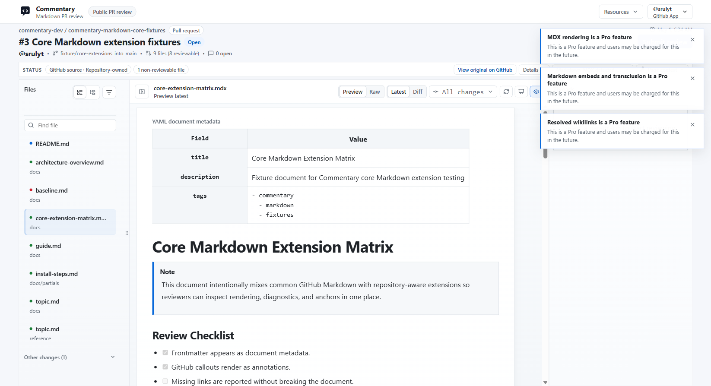
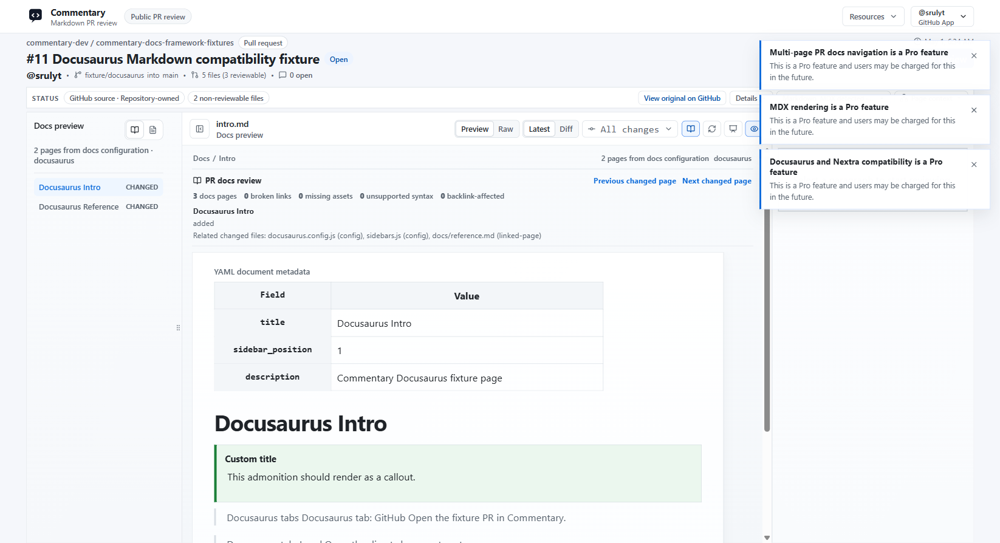

# Markdown Extensions

Commentary renders GitHub-flavored Markdown first, then adds compatibility for documentation systems and AI-generated docs that usually need repository context.

## Core Extensions

Rendered Markdown can include:

- front matter shown as reviewable document metadata
- GitHub callouts and task lists
- Mermaid diagrams, with readable source fallback when rendering fails
- repository-relative links and images
- wikilinks, backlinks, and missing-link indicators
- Markdown embeds and transclusion blocks
- safe MDX placeholders for imports, exports, and custom components

Resolved links stay inside the current Commentary review when the target is another reviewable repository document. Missing or unsupported targets remain readable instead of breaking the page.

## Docs Framework Compatibility

Commentary detects common documentation shapes and can expose a docs-preview surface for multi-page review.

Supported compatibility surfaces include:

- Docusaurus and Nextra docs
- MkDocs and Material-style syntax
- VitePress and VuePress containers
- DocFX and Microsoft Learn extensions
- Hugo shortcodes
- Jekyll Liquid includes and placeholders
- Astro Markdown and MDX content

Docs preview adds page navigation, breadcrumbs, related changed files, and a PR docs review summary while keeping paragraph comments attached to the rendered document.

## Slides And Present Mode

Markdown slide decks can render as Marp, Reveal.js, or Slidev previews when the file uses recognizable deck syntax or a render profile is selected.

Use Present mode when you want a cleaner screen-share or meeting review surface. It hides normal review chrome, supports slide or heading navigation, preserves comments as optional markers, and can show presenter notes for supported slide formats.

## Pro Preview Notices

Some extension surfaces are marked as Pro preview features. During the preview period, they remain usable and show a dismissible notice when accessed. Core rendered Markdown, public review access, comments, refresh, review submission, and Present mode remain available as normal review features.

