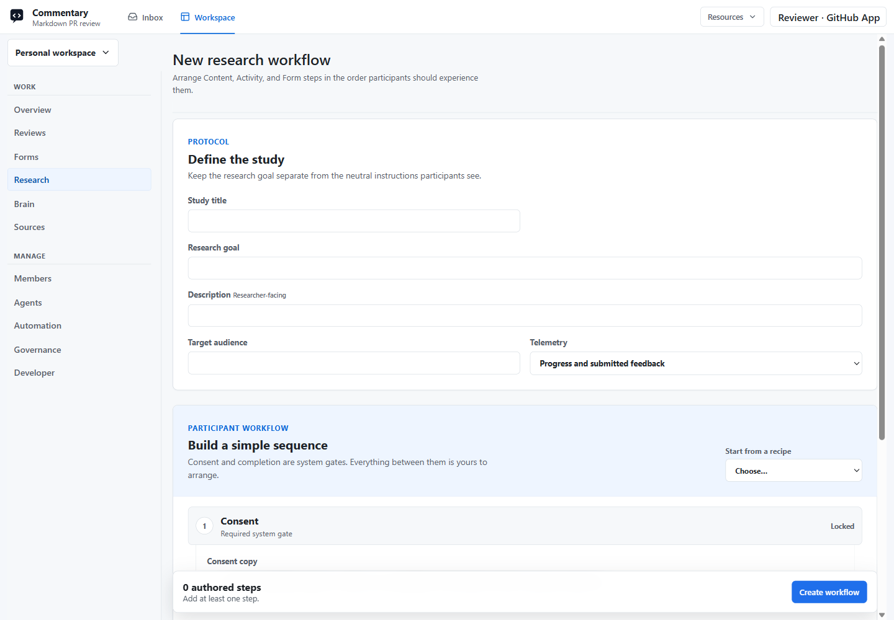

# Research Studies

Research Studies combine documents, interactive activities, and structured Forms into one participant workflow. Open **Workspace → Research → New research study** to define the study and its sequence.

*Captured on commentary.dev on September 15, 2026. Account identity is anonymized; this is an unsaved creation screen.*

## Build A Linear Workflow

The sequence is always **Consent → your ordered steps → Complete**. Consent and Complete are locked system gates. Add any ordered mix of these three step types, including repeated types:

| Step | What participants do | What you configure |
| --- | --- | --- |
| Content | Read a document or presentation | An authorized file from a Draft, PR, or branch Review, its path, and Document/Presentation mode. |
| Activity | Try an interactive website | Instructions, URL/route, delivery mode, evidence mode, and optional success criteria/outcome collection. |
| Form | Answer structured questions | A source-backed Commentary Form, purpose, required/optional status, and permitted adaptive behavior. |

Position defines sequence. There are no task wrappers, Form placements, branches, loops, or automation triggers. For example: Consent → introduction deck → navigation Activity → feedback Form → Complete.

Give the study a title, research goal, audience, and participant-appropriate consent copy. Keep researcher-facing goals separate from neutral instructions shown to participants. Recipes such as Usability test, Concept review, and Guided interview are editable starting points, not fully configured studies.

Use searchable pickers for compatible workspace artifacts, or configure an authorized source explicitly where offered. New Content steps default to Presentation. Reorder steps by dragging their collapsed row, using move buttons, or Alt+Arrow keyboard controls. Configure each step before saving.

## Source, Launch, And Revisions

The study has **Overview**, **Plan**, and **Results**, with settings for supported management actions. Overview shows launch readiness and study progress; Plan shows the participant sequence.

Browser authoring creates a Draft Review containing the authoritative Research Contract v2. Saving subsequent changes versions that source. Git-backed protocols must be updated through their authorized source flow. A database-only working projection is insufficient for launch.

Resolve launch-readiness issues before launching. Commentary checks consent, current source access, exact Form contracts, Content artifacts, and Activity readiness again at launch. It publishes an immutable workflow revision and pins each participant session to the revision it starts on.

While collection is active, Plan remains readable with full configuration details. Use **Pause to edit** or **Pause and edit** before changing the participant-facing structure. Existing sessions remain on their original revision. Archived studies lead to results rather than presenting an active editor.

## Activity Delivery And Evidence

Delivery and evidence are independent choices:

- **Embedded** keeps the website inside the participant shell; **New tab** opens it as a top-level site.
- **SDK-tracked** requires compatible Review SDK capabilities and successful validation.
- **Manual** uses explicit participant feedback and completion without claiming observed behavior.

Tracked standalone activities place instructions, conversation, optional outcome, and **Done and return** in the isolated overlay. The original Research tab receives server-owned progress and advances after completion. Closing the target early leaves the step active with **Reopen** available.

Manual activities have no Commentary overlay in the target site. Participants return to the Research tab to report and finish the step. Missing telemetry is not evidence of failure, success, or abandonment. Finishing an Activity does not itself imply success; optional outcomes distinguish success, partial success, and failure.

The embedded toolbar exposes the current validated URL and copy control. An SDK timeout means the preview did not connect; it does not reliably identify a host's framing policy. Use the offered recovery or configured manual workflow.

## Participants, Results, And Privacy

After launch, use the participant-link controls to invite participants through the consent gate. Participant access uses the study flow rather than granting the normal owner workspace. Sessions retain their step progress and one conversation; comments and Form answers remain associated with the relevant step and run.

Results start with summary information and step-level evidence. Open a participant session for its sequence, comments, responses, and events. Keep observed evidence, researcher interpretation, and recommendations distinct. Settings and exports follow owner/source authorization and the study's privacy configuration.

Choose progress/submitted feedback, privacy-filtered behavioral signals, or no behavioral telemetry as appropriate to the study. Sampled pointer paths are bounded evidence, not full DOM replay. The SDK excludes sensitive/private regions and does not capture raw typed input values.

Source-backed evidence destinations and analysis artifacts require their own authorized configuration and deliberate export/synchronization. Saving a study does not automatically publish results or give an agent provider write access.

## API And MCP

Use `/api/v2/research-studies` and `commentary_research` capability version **2**. Reads expose studies, sessions, results, steps, and events. Authorized external-agent interventions can reply to a comment or ask a follow-up on the active workflow step. `commentary.research.read` and `.write` are separate scopes; they do not grant owner-only authoring or launch authority.

Evidence and interventions use `stepId` and `stepRunId`. Research Contract v2 uses `commentaryResearch: 2`; the v1 contract/runtime is retired, with no automatic converter. The old `/api/v1/research-studies` route returns `410 Gone` during its compatibility window. Consult the current [API reference](api/reference.md) and [MCP tools](api/mcp-tools.md) for exact request shapes.

Research Studies, agent access, templates, and supported destination/export capabilities are Pro-preview features, usable during the current no-billing phase. Forms retain their own feature and authorization rules.
