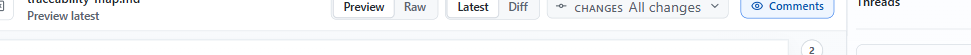
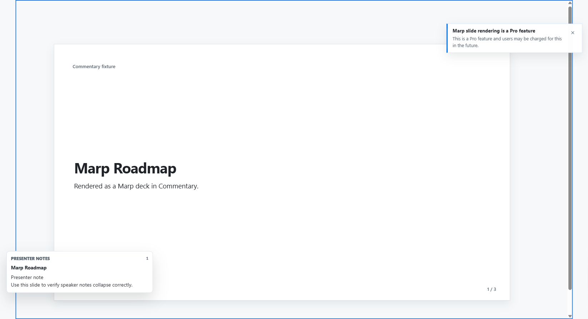

# Review Modes

Commentary separates three decisions: the surface you read, whether you want a clean document or changes, and the exact version or comparison.

## Surface

- `Preview` renders Markdown as a document.
- `Preview` also renders supported static HTML in a sandboxed document frame.
- `Raw` shows Markdown or HTML source.
- `Docs preview` appears when Commentary detects a supported docs-site structure.
- `Present` opens a cleaner rendered-document or slide-deck view for meetings and screen sharing.

Use `Preview` for prose review. Use `Raw` when exact document syntax, source line context, or wrapping behavior matters.

## Document And Changes

- `Document` shows a clean snapshot without diff markup. Choose Current or a historical version from the adjacent newest-first selector; if history cannot be loaded, Commentary explains that no snapshots are available instead of showing an empty menu.
- `Changes` shows a comparison. Choose a recommended range, a revision or PR update, a commit, or Custom comparison.
- Switching Preview and Raw keeps the selected document or comparison unchanged.
- Historical documents and comparisons stay pinned when new updates arrive.

When a historical document is open, Commentary shows a quiet notice with actions to return to current or compare it with current. Historical draft revisions are read-only.

## Comparisons

- `All PR changes` compares the immutable PR base and head SHAs captured by the link.
- `Latest PR update` appears when Commentary has recorded two distinct refresh endpoints.
- Commit options compare a commit with its first parent.
- Custom comparison asks for a Newer version followed by an Older version. Commentary always uses the older version as the baseline and the newer version as the result, so additions and removals keep their normal meaning.
- Files that do not participate in the selected commit may appear disabled.
- If a commit has no Markdown changes, Commentary shows an explicit empty state.

Histories are newest-first, bounded, scrollable, and searchable when they contain more than 12 entries.

## Exact Links

- Current document: the normal review URL, optionally with `surface`.
- Historical document: `version=<stable-ref>`.
- Comparison: `scope=diff&from=<stable-ref>&to=<stable-ref>&preset=<semantic-id>`.

Git-backed refs use full commit SHAs. Draft refs use stable revision ids. Older `view`, `diff`, `commit`, `changes`, `revision`, and `baseRevision` links remain compatible and are normalized to the current URL shape; reversed custom ranges are normalized to older baseline and newer result.

## Raw Word Wrap

Raw latest and raw diff views support word wrap. Keep word wrap on for reading prose source, and turn it off when exact horizontal layout matters.

## Docs Preview And Present Mode

Docs preview keeps docs-framework navigation near the rendered page and adds PR docs summary context when available. Present mode hides normal review chrome, supports heading or slide navigation, and can show optional comment markers and speaker notes.

## Comments Rail And Files Rail

Use the `Comments` control to show or hide the thread rail. Use the file control to collapse or reopen the navigator when you need more document width.
