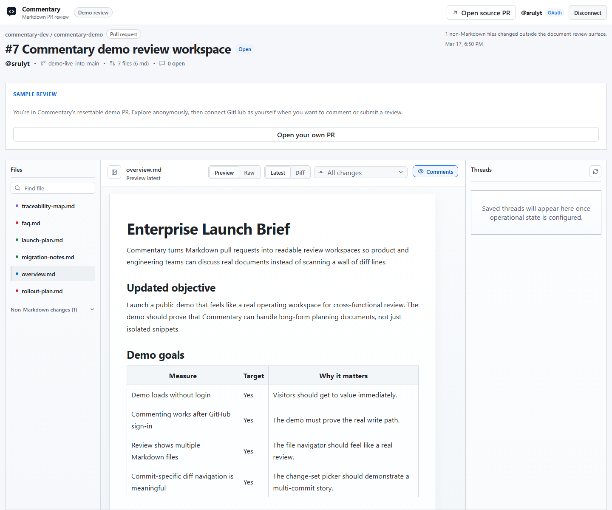

# Review Pull Requests

Commentary's default flow starts with a GitHub pull request.

## Open A Review

1. Copy a GitHub PR URL.
2. Open [/](https://commentary.dev/).
3. Paste the URL.
4. Click `Open review`.

Public PRs open without login. Private PRs require GitHub access.

## Work In The Reading Shell

- Use the file navigator to move between changed Markdown files.
- Stay in `Preview` for normal reading.
- Switch to `Raw` if you need source-level context.
- Use `Latest` first, then `Diff` when you need to inspect the change.

Single-file Markdown PRs keep the experience tighter by hiding the navigator until you need it. Multi-file reviews expose the navigator from the start.

## Comment And Reply

To add a thread or reply, sign in first.

Once authenticated, you can:

- add a new thread from the rendered document
- reply in the thread rail
- resolve or reopen threads
- keep draft threads pending until review submission

## Submit The Review

On PR routes, Commentary keeps draft review state locally until you click `Submit review`.

Use `Submit review` when you are ready to send the review event back to GitHub. This is the handoff point between Commentary's document-first workflow and GitHub's provider workflow.

## Use `Diff` Intentionally

`Diff` is useful when you need to answer one of these questions:

- What changed in this paragraph or section?
- Did this file change in the selected commit?
- Do I need to inspect the raw Markdown instead of the rendered view?

For everything else, `Preview` plus `Latest` is the fastest reading mode.

