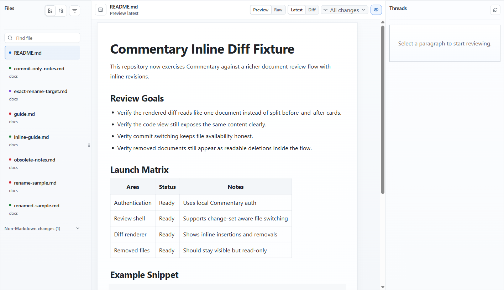
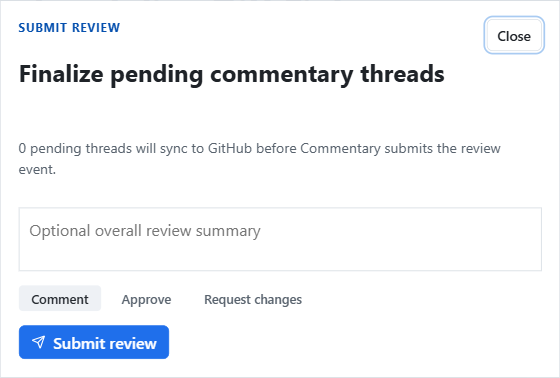

# Review Pull Requests

Commentary's default workflow starts with a pull request URL.

## Open A Review

1. Copy a GitHub or Azure DevOps pull request URL.
2. Open [/](https://commentary.dev/).
3. Paste the URL.
4. Click `Open review`.

Public GitHub PRs can open read-only without login. Private PRs and Azure DevOps routes require provider access.

## Work In The Review Shell

- Use the file navigator to move between Markdown, MDX, static HTML, and standalone Form Contract files.
- Use folder view when a PR changes several docs across directories.
- Switch files inside the review shell without losing the surrounding review context.
- Use progress status to track which files or sections you have already reviewed.
- Stay in `Preview` for normal reading.
- Switch to `Raw` for Markdown, HTML, YAML, or JSON source context.
- Start with `Latest`, then use `Diff` when you need the change.
- Collapse or expand H2-H6 sections in Latest rendered Markdown.
- Copy heading deep links when you need to point someone at a rendered section.
- Use docs preview when a docs framework route is detected.
- Use Present mode when a rendered document or slide deck needs a meeting-friendly view.
- Use the change-set menu to review all changes or one commit.
- Use `Comments` to show or hide the thread rail.

Single-file Markdown PRs keep the shell tighter. Multi-file PRs show the file navigator with flat and folder views, filters, selected rows, and persisted navigator width.

Merged GitHub PR links can redirect to the target branch document review after a short countdown. The branch view is filtered to the PR's reviewable files, while historical PR comments remain available on the PR review link.

## Review Specialized Content

- Markdown extension rendering covers MDX, Mermaid, wikilinks, embeds, docs frameworks, and slide decks. See [Markdown extensions](./markdown-extensions.md).
- Static HTML review opens `.html` and `.htm` files with sandboxed previews and semantic anchors. See [Static HTML review](./static-html-review.md).
- Commentary Forms open standalone contracts or embedded form blocks for structured answers. See [Commentary Forms](./commentary-forms.md).
- Knowledge Brain mode groups source, wiki, output, and control files for AI-maintained knowledge-base branches. See [Knowledge Brain](./knowledge-brain.md).

## Comment And Reply

Sign in before adding or replying to comments.

Once authenticated, you can:

- add a new thread from a rendered block
- select text and create a focused thread
- reply in the thread rail with safe rendered Markdown
- open long or wide comments in a focused reading view
- resolve or reopen threads
- use poll comments when a thread needs structured choices
- keep pending PR threads staged until review submission

On GitHub PR routes, eligible provider-pending comments can sync before review submission when Commentary drains pending work after a comment, reply, or status-comment write. New GitHub comments can also import through refresh or webhook processing, and open review pages can receive live comment events without a manual page refresh.

## Submit The Review

On PR routes, Commentary stages pending review work locally until you click `Submit review`.

The submit dialog shows how many pending threads still need to sync before the provider review event is sent. Choose `Comment`, `Approve`, or `Request changes`, optionally add an overall summary, then submit.

## Use `Diff` Intentionally

`Diff` is useful when you need to answer:

- What changed in this paragraph, table row, or section?
- Did this file change in a selected commit?
- Is the rendered change clearer than the raw Markdown?

For normal reading, `Preview` plus `Latest` is usually faster.
