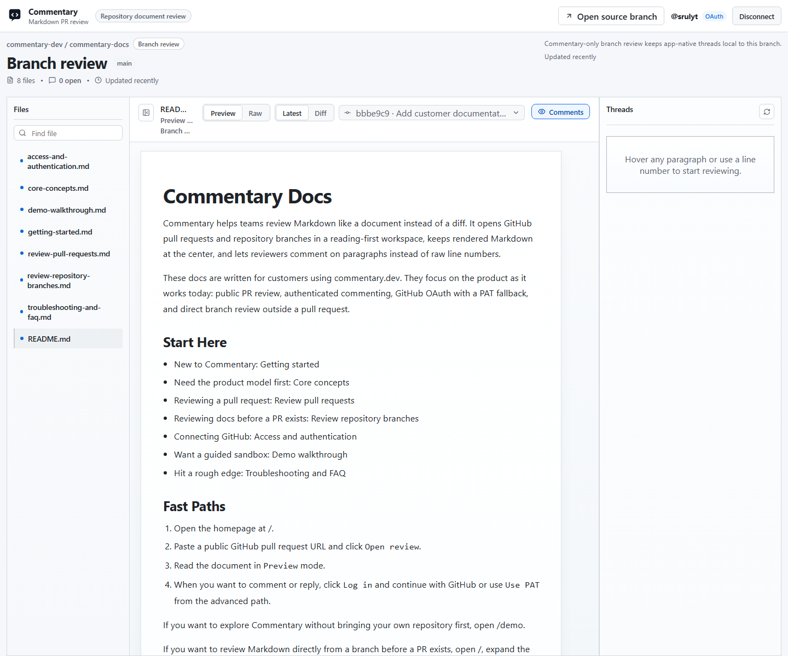

# Review Repository Branches

Use branch review when the document is in a repository but not in a pull request yet.

## Open A Branch Review

1. Open [/](https://commentary.dev/).
2. Expand the repository path under the main PR intake.
3. Paste a GitHub repository URL.
4. Optionally enter a branch name.
5. Click `Open docs`.

You can also open a repository tree URL directly if you already know the branch.

## What Changes In Branch Review

- The same reading shell is used.
- The page is labeled as a repository document review instead of a pull request review.
- There is no `Submit review` button.
- `Refresh document` replaces `Refresh PR`.
- Comments stay app-native in Commentary.

## File And Branch Navigation

- The file navigator lists Markdown files from the selected branch.
- If the repository exposes multiple branches in the review shell, you can switch branches there.
- Commentary opens one Markdown file at a time and keeps the document as the primary surface.

## Best Use Cases

- Specs that need early review before the implementation PR exists
- Repository docs that live on `main` and still need discussion
- Branch-based doc drafting that should not create a GitHub review event yet

## Important Difference From PR Review

Branch review is not a lightweight PR review. It is its own mode:

- no GitHub review submission
- no provider-backed review event
- Commentary-only comment persistence

That makes it a better fit for document collaboration outside a code-review moment.
