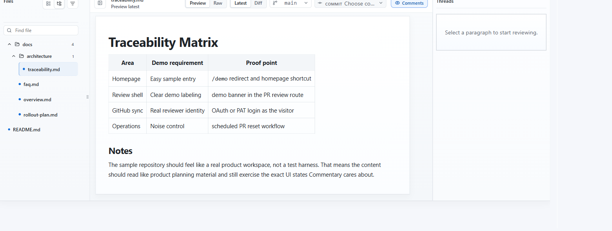

# Review Repository Branches

Use document review when Markdown or static HTML is in a repository but not necessarily in a pull request.

## Open A Document Review

1. Open [/](https://commentary.dev/).
2. Paste a repository, branch, folder, Markdown file, MDX file, or static HTML file URL.
3. Click `Open review`.

For GitHub, Commentary accepts repository roots, `/tree/...` URLs, and `/blob/...` Markdown or HTML URLs. For Azure DevOps, use a project-scoped repository, PR, branch, folder, or file URL when possible.

## What Changes In Document Review

- The same reading shell is used.
- The page is labeled as repository document review instead of pull request review.
- There is no `Submit review` button.
- `Refresh document` replaces `Refresh PR`.
- Comments stay app-native in Commentary.

## Branch, Folder, And File Navigation

- The file navigator lists reviewable Markdown, MDX, and static HTML files from the selected branch or folder.
- Use the branch selector to switch branch context when available.
- Use folder view for docs-heavy repositories.
- Use `Document` for reading and `Changes` for branch-backed change inspection.
- Use the commit selector when you need to inspect one document change set.
- Switch files inside the shell without a full page reload when the next document projection is available or can be materialized.
- Use personal [Review progress](./review-progress.md) to mark files or sections reviewed and revisit changed-since-reviewed content.

## Best Use Cases

- specs that need early feedback before implementation is ready
- ADRs and product docs living on a shared branch
- README and docs maintenance outside a PR moment
- AI-generated docs that should be reviewed before a merge request exists
- generated static reports or static site pages that need document comments
- Knowledge Brain branches where source notes, wiki pages, and outputs should be reviewed together
- merged PR follow-up when a GitHub PR has already landed and the review should continue against the target branch

## Important Difference From PR Review

Document review does not submit a provider review event. It is designed for app-native collaboration around repository documents.
