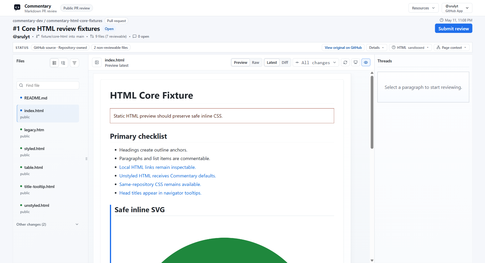

# Static HTML Review

Commentary can review static `.html` and `.htm` files in the same document-first workspace as Markdown.

## What Works

Static HTML files open with:

- rendered `Preview` mode
- `Raw` source mode
- file navigation across changed or branch files
- outline navigation for headings and meaningful sections
- semantic comment anchors for headings, sections, rows, cards, figures, and other stable blocks
- app-native comments and replies
- sanitized Commentary Forms bindings when the HTML declares compatible form controls

HTML authors do not need to add Commentary IDs, custom tags, or `data-commentary-*` attributes for ordinary review anchors. Commentary uses ordinary structural and content signals such as element type, headings, nearby text, IDs, classes, ARIA labels, titles, alt text, links, table labels, figure captions, and sibling context.

## Forms In Static HTML

Static HTML can bind controls to a Form Contract with declarative `data-commentary-field` metadata. Commentary validates values against the contract, reports binding diagnostics, and submits through the same server-side Forms validation path as native Forms.

HTML bindings do not trust form `action`, inline handlers, customer scripts, or unsafe page behavior. See [Commentary Forms](./commentary-forms.md).

## Safety Model

HTML preview is sandboxed. Commentary strips or blocks active behavior that would make review unsafe or misleading:

- scripts do not run
- event handlers are removed
- dangerous URLs are removed
- active embeds are blocked
- unsafe stylesheet behavior is restricted

When restrictions affect a file, the review shell shows a compact status summary so reviewers know the preview is intentionally safer than a full browser page.

## Current Boundaries

Static HTML review is for document-like artifacts, generated reports, and static pages. It is not a live deployment preview. JavaScript execution, multi-page crawling, full browser fidelity, and visual HTML diff are outside the current review surface.

Provider sync for rendered HTML comments is best effort. When Commentary cannot map a rendered HTML comment to reliable provider source lines, the thread stays app-native or syncs with file-level context.
