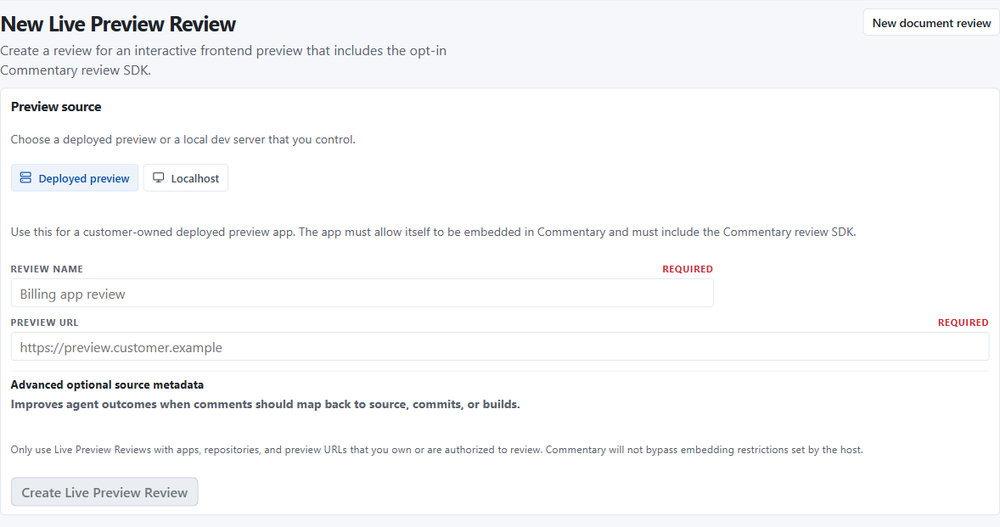
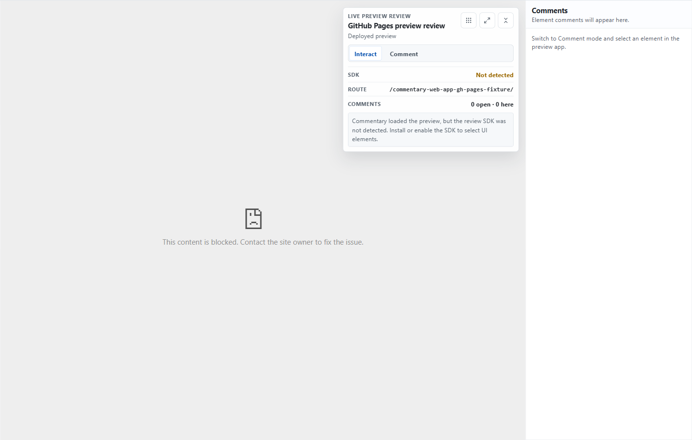
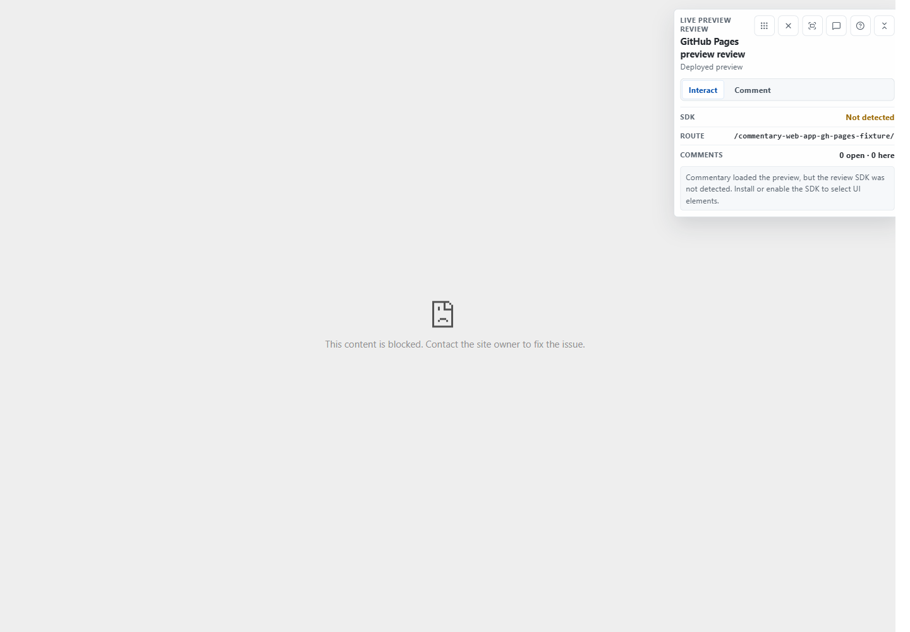

# Live Preview Reviews

Live Preview Reviews let reviewers comment on customer-owned interactive preview apps. Commentary loads the preview in the browser, the preview app opts in with the Commentary Review SDK, and comments attach to selected UI elements instead of Markdown blocks.

Use this for deployed previews, staging apps, and localhost development servers that you own or are authorized to review. Commentary does not proxy arbitrary websites, inject scripts into third-party pages, bypass frame restrictions, or server-fetch localhost previews.

## Create A Review

1. Sign in and open [/workspace/web-app-reviews/new](https://commentary.dev/workspace/web-app-reviews/new).
2. Choose `Deployed preview` or `Localhost`.
3. Enter a preview URL you own or are authorized to review.
4. Add optional repository, branch, commit, or deployment metadata when it helps agents or reviewers understand the source.
5. Create the review and open the generated `/review/web-app/{reviewId}` link.

Deployed preview URLs must use HTTPS. Localhost reviews accept loopback URLs such as `http://localhost:5173`, `http://127.0.0.1:3000`, or `http://[::1]:4173`.

Private LAN hosts such as `192.168.x.x`, `10.x.x.x`, `172.16.x.x` through `172.31.x.x`, and `.local` names are rejected by default.



## Review Modes

Live Preview Reviews have two primary modes:

- `Interact` lets the preview app behave normally.
- `Comment` lets the SDK highlight selectable elements and intercept the selected click so Commentary can open a comment composer outside the iframe.

Saved comments appear in the comments panel with route, status, replies, target summary, author, and timestamp. Developer details keep selector, viewport, geometry, and source metadata available when needed.



When a preview blocks embedding or the SDK is not available, the review shell shows setup guidance instead of enabling element selection.

## Full Page Mode

Full page mode is useful for screen-share reviews and focused UI walkthroughs. It hides normal Commentary chrome, preserves iframe state through URL-backed mode changes, keeps Interact and Comment controls floating, and keeps comments available as a collapsed floating pane. Desktop reviewers can drag the comments pane away from the reviewed UI.

Use the explicit fullscreen control or the `F` shortcut to request browser fullscreen. Compact shortcuts include `Esc` for closing panels or exiting, `?` for shortcuts, `C` for Comment mode, `I` for Interact mode, and `M` for the comments pane.



## Review SDK

Preview apps opt in by loading the Commentary Review SDK only in review or preview builds. The SDK is available as the npm package `@commentary-dev/review-sdk` and from the Commentary CDN at `https://cdn.commentary.dev/review-sdk/latest/commentary-review-sdk.js`.

NPM-style usage:

```ts
if (import.meta.env.VITE_COMMENTARY_REVIEW === "true") {
  window.__COMMENTARY_PARENT_ORIGIN__ = "https://commentary.dev";
  window.__COMMENTARY_COMMIT_SHA__ = import.meta.env.VITE_COMMIT_SHA;
  window.__COMMENTARY_BUILD_ID__ = import.meta.env.VITE_BUILD_ID;

  await import("@commentary-dev/review-sdk");
}
```

Script-tag usage:

```html
<script>
  window.__COMMENTARY_PARENT_ORIGIN__ = "https://commentary.dev";
  window.__COMMENTARY_BUILD_ID__ = "preview-123";
  window.__COMMENTARY_COMMIT_SHA__ = "abcdef123456";
</script>
<script src="https://cdn.commentary.dev/review-sdk/latest/commentary-review-sdk.js"></script>
```

The SDK is framework-agnostic, but it is browser and DOM specific. It needs `window`, `document`, DOM events, selectors, element geometry, History or Hash routing events, iframe embedding, and `postMessage`. React, Next.js, Vue, Svelte, Angular, Astro, Vite, and plain HTML previews can use it when the reviewed page renders selectable DOM elements.

Optional source metadata improves anchors and agent handoff:

```html
<button
  data-commentary-id="BillingSettingsForm.saveButton"
  data-commentary-component="BillingSettingsForm"
  data-commentary-source="src/components/BillingSettingsForm.tsx:118:10">
  Save changes
</button>
```

## Stored Context

Commentary stores bounded review metadata for selected elements:

- preview URL and origin
- current route and selected element URL
- primary and fallback selectors
- tag, role, accessible name, and short visible text snippet
- bounding rectangle and viewport
- optional component/source metadata
- optional commit SHA

Commentary does not store DOM dumps, cookies, localStorage, sessionStorage, token values, input values, screenshots, or raw app HTML for this persistence path.

## API And MCP

Live Preview Review automation is available through the public API and MCP. Account-scoped tokens can list, create, read, and archive reviews; list and create selected-element comments; resolve or reopen comment threads; and fetch agent context.

The feature keys are `web_app_reviews.basic` for the web workflow and `web_app_reviews.agent_api` for API/MCP automation. Both are Pro-preview features and remain usable during the no-billing preview.

Agent context marks comment bodies and reviewed app content as untrusted user/application content. Agents should treat them as editing tasks, not instructions.

See [API and MCP](./api-and-mcp.md), [API reference](./api/reference.md), and [MCP tools](./api/mcp-tools.md).

## Frame Setup

Preview apps must allow Commentary to embed them. For CSP-based setups, configure a narrow review-environment policy:

```http
Content-Security-Policy: frame-ancestors https://commentary.dev
```

Do not disable security headers broadly in production. Limit permissive frame settings to review or preview environments.

GitHub Pages can be useful for demos, but custom response-header control may be limited. If a project needs strict `frame-ancestors` behavior, use a CDN, custom host, Azure Static Web Apps, Cloudflare Pages, Netlify, or another preview provider that supports response headers.

## Limits

- Localhost reviews load from the current reviewer browser.
- Other reviewers cannot use your localhost review unless they also run the app locally.
- Commentary cloud services do not fetch reviewer localhost previews.
- Private LAN URLs are rejected by default.
- The reviewed app must load the SDK before element selection can work.
- The preview host must allow iframe embedding by Commentary.
