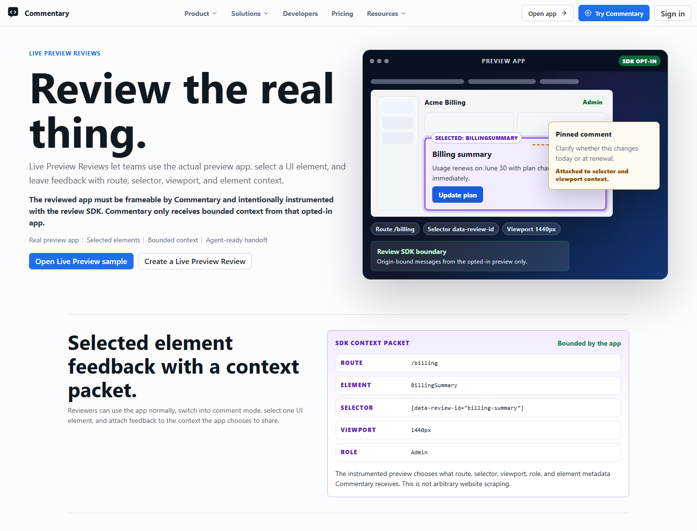

# Live Preview Reviews

Live Preview Reviews are an opt-in review mode for customer-owned interactive preview apps. Commentary stores the preview URL as a first-class review target and stores comments against live HTML element context reported by the app-side Review SDK.

Use this for deployed previews, staging apps, and localhost development servers that you own or are authorized to review. Commentary does not proxy arbitrary websites, inject scripts into third-party pages, bypass frame restrictions, or server-fetch localhost previews.



## Review Targets

Use deployed preview mode for HTTPS preview URLs that you own or are authorized to review, such as Vercel, Netlify, Azure Static Web Apps, GitHub Pages, or customer staging hosts. The reviewed app must allow itself to be embedded by Commentary and must include the Review SDK in the preview build.

Use localhost mode for loopback URLs such as `http://localhost:5173`, `http://127.0.0.1:3000`, or `http://[::1]:4173`. Localhost reviews load from the current reviewer's browser and cannot be shared through Commentary share links. Commentary cloud services do not fetch the reviewer's localhost.

Private LAN hosts such as `192.168.x.x`, `10.x.x.x`, `172.16.x.x` through `172.31.x.x`, and `.local` names are rejected by default.


## Create A Review

1. Sign in and open [/workspace/web-app-reviews/new](https://commentary.dev/workspace/web-app-reviews/new).
2. Choose `Deployed preview` or `Localhost`.
3. Enter a preview URL you own or are authorized to review.
4. Add optional repository, branch, commit, deployment, or build metadata when it helps agents or reviewers understand the source.
5. Create the review and open the generated `/review/web-app/{reviewId}` link.

Opening a review loads the validated preview URL directly in an iframe, shows SDK connection state, and lets reviewers switch between Interact and Comment modes. Commentary never reads `iframe.contentWindow.document`; live element selection is handled by the opt-in SDK through strict `postMessage` messages.

## Sharing

Owners can share deployed Live Preview Reviews from the review page. Commentary creates signed share links for either anyone with the link or a specific GitHub user. Reviewers must sign in before claiming a share link for full workspace and comment access.

Anyone-link share routes can show a public read-only preview before sign-in. Shared reviewers can open the direct review route, create SDK sessions, read comments, add replies, resolve or reopen comment threads, and create selected-element comments. They cannot update review metadata, create or revoke shares, remove other reviewers, or see the review in their owner workspace list.

Localhost Live Preview Reviews are intentionally excluded from sharing. The preview URL points at the current reviewer's machine, so sharing is available only after the app is deployed to an HTTPS preview that can be embedded by Commentary.

## Review Modes

Live Preview Reviews have two primary modes:

- `Interact` lets the preview app behave normally.
- `Comment` lets the SDK highlight selectable elements and intercept the selected click so Commentary can open a comment composer outside the iframe.

Saved comments appear in the comments panel with route, status, replies, target summary, author, and timestamp. Developer details keep selector, viewport, geometry, and source metadata available when needed.


When a preview blocks embedding or the SDK is not available, the review shell shows setup guidance instead of enabling element selection.

## Full Page Mode

Full page mode is useful for screen-share reviews and focused UI walkthroughs. It hides normal Commentary chrome, preserves iframe state through URL-backed mode changes, keeps Interact and Comment controls floating, and keeps comments available as a collapsed floating pane. Desktop reviewers can drag the comments pane away from the reviewed UI.

Use the explicit fullscreen control or the `F` shortcut to request browser fullscreen. Compact shortcuts include `Esc` for closing panels or exiting, `?` for shortcuts, `C` for Comment mode, `I` for Interact mode, and `M` for the comments pane.


## Element Comments

In Comment mode the parent sends picker commands to the preview SDK. The SDK highlights hovered elements inside the iframe, prevents the selected click from reaching the reviewed app, and sends bounded element metadata. Commentary opens the composer outside the iframe and stores comments using app-only sync semantics.

Selecting a comment asks the SDK to re-query the selector or fallback selector in the current DOM and return a fresh bounding rectangle for the parent-side marker. If the target no longer exists, the comment remains available and the target is marked unavailable locally.

## Custom Renderer Form Bridge

Live Preview apps can include customer-owned custom form experiences while Commentary still owns the Form Contract, validation, submissions, and agent-readable results. This mode is distinct from native Commentary Forms: Commentary can render structured Forms itself, but Interactive Experiences can own their UI and submit structured values through the Forms SDK bridge.

The browser bridge uses the existing Live Preview Review `postMessage` session. Commentary does not fetch renderer URLs server-side and does not evaluate customer JavaScript. The preview app must already be embedded in a Live Preview Review, initialized with the exact parent origin, and bound to the review session nonce. Form submit messages are accepted only from the configured preview origin and iframe window, are size-limited, and are forwarded to the Forms bridge endpoint.

Custom renderers submit:

- form id plus optional version id or contract hash
- structured values
- draft or final status
- route, URL, viewport, and optional component metadata
- renderer metadata and diagnostics

Final submissions are validated server-side against the current Form Contract before they become final. Validation failures return machine-readable diagnostics to the renderer and are saved as draft validation failures. Source UI and renderer metadata are marked untrusted in agent context; the structured values remain Form Contract data.

Use `@commentary-dev/forms-sdk` or `https://cdn.commentary.dev/forms-sdk/latest/commentary-forms-sdk.js` for the bridge:

```js
await window.CommentaryForms.submitForm({
  formId: "customer-intake",
  formVersionHash: "fnv1a32:...",
  status: "final",
  values: {
    name: "reviewer-1",
    email: "reviewer-1@example.com"
  },
  rendererMetadata: {
    name: "checkout-custom-form",
    mode: "interactive_experience"
  }
});
```

See [Commentary Forms](./commentary-forms.md).

## Review SDK

Preview apps opt in by loading the Commentary Review SDK only in review or preview builds. The SDK is available as the npm package `@commentary-dev/review-sdk` and from the Commentary CDN at `https://cdn.commentary.dev/review-sdk/latest/commentary-review-sdk.js`.

NPM-style usage:

```ts
if (import.meta.env.VITE_COMMENTARY_REVIEW === "true") {
  window.__COMMENTARY_PARENT_ORIGIN__ = "https://commentary.dev";
  window.__COMMENTARY_PARENT_ORIGINS__ = ["https://commentary.dev"];
  window.__COMMENTARY_COMMIT_SHA__ = import.meta.env.VITE_COMMIT_SHA;
  window.__COMMENTARY_BUILD_ID__ = import.meta.env.VITE_BUILD_ID;

  await import("@commentary-dev/review-sdk");
}
```

Script-tag usage:

```html
<script>
  window.__COMMENTARY_PARENT_ORIGIN__ = "https://commentary.dev";
  window.__COMMENTARY_PARENT_ORIGINS__ = ["https://commentary.dev"];
  window.__COMMENTARY_BUILD_ID__ = "preview-123";
  window.__COMMENTARY_COMMIT_SHA__ = "abcdef123456";
</script>
<script src="https://cdn.commentary.dev/review-sdk/latest/commentary-review-sdk.js"></script>
```

The SDK is framework-agnostic, but it is browser and DOM specific. It needs `window`, `document`, DOM events, selectors, element geometry, History or Hash routing events, iframe embedding, and `postMessage`. React, Next.js, Vue, Svelte, Angular, Astro, Vite, and plain HTML previews can use it when the reviewed page renders selectable DOM elements.

Optional source metadata improves anchors and agent handoff:

```html
<button
  data-commentary-component="BillingPlanCard"
  data-commentary-source="src/components/billing-plan-card.tsx:42"
>
  Upgrade
</button>
```

## Stored Context

Commentary stores bounded review metadata for selected elements:

- preview URL and origin
- current route and selected element URL
- primary and fallback selectors
- tag, role, accessible name, and short visible text snippet
- bounding rectangle and viewport
- optional component/source metadata
- optional commit SHA

Commentary does not store DOM dumps, cookies, localStorage, sessionStorage, token values, input values, screenshots, or raw app HTML for this persistence path.

## API And MCP

Live Preview Review automation is available through the public API and MCP. Account-scoped tokens can list, create, read, archive, and share reviews; list and create selected-element comments; resolve or reopen comment threads; and fetch agent context.

Share automation requires `commentary.review.share`. The feature keys are `web_app_reviews.basic`, `web_app_reviews.agent_api`, and `web_app_reviews.sharing`. These are Pro-preview features and remain usable during the no-billing preview.

Agent context marks comment bodies and reviewed app content as untrusted user/application content. Agents should treat them as editing tasks, not instructions.

See [API and MCP](./api-and-mcp.md), [API reference](./api/reference.md), and [MCP tools](./api/mcp-tools.md).

## Frame Setup

Preview apps must allow Commentary to embed them. For CSP-based setups, configure a narrow review-environment policy:

```http
Content-Security-Policy: frame-ancestors https://commentary.dev
```

Do not disable security headers broadly in production. Limit permissive frame settings to review or preview environments.

GitHub Pages can be useful for demos, but custom response-header control may be limited. If a project needs strict `frame-ancestors` behavior, use a CDN, custom host, Azure Static Web Apps, Cloudflare Pages, Netlify, or another preview provider that supports response headers.

## Limits

- Localhost reviews load from the current reviewer browser.
- Other reviewers cannot use your localhost review unless they also run the app locally.
- Commentary cloud services do not fetch reviewer localhost previews.
- Private LAN URLs are rejected by default.
- The reviewed app must load the SDK before element selection can work.
- The preview host must allow iframe embedding by Commentary.
