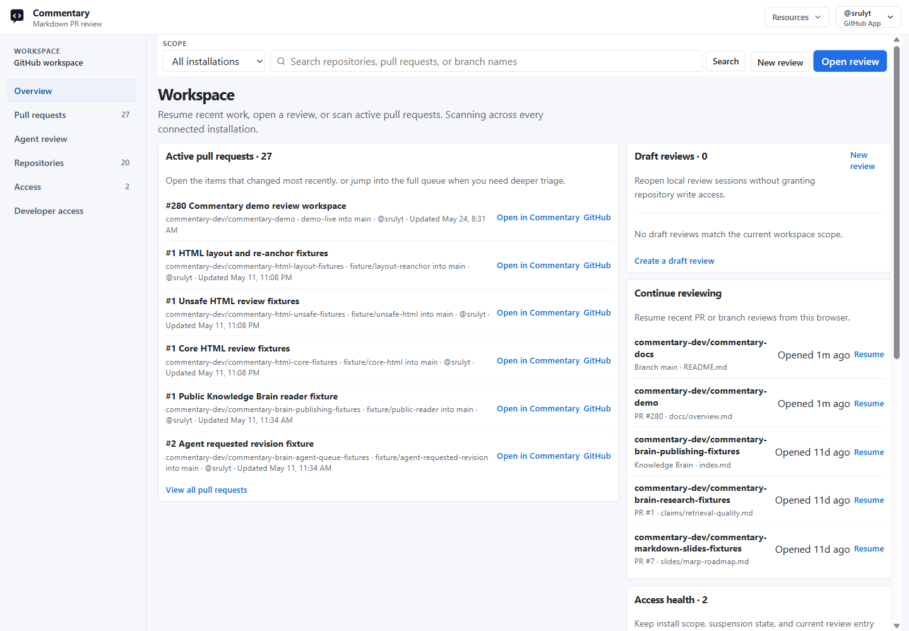
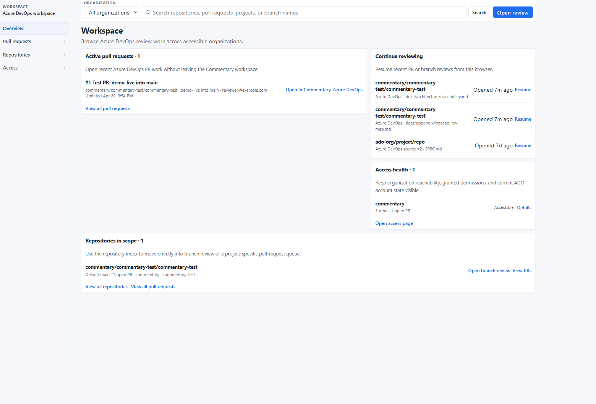

# Workspace

The workspace is the signed-in view for finding review work, creating drafts, and managing developer access across connected provider accounts.

## What The Workspace Does

- shows active pull requests
- lists repositories in scope
- resumes recent review sessions from this browser
- shows provider access health
- opens PR review and branch review without copying URLs
- creates and resumes draft reviews
- creates and resumes Brainstorming Reviews
- manages API, OAuth, device-flow, and MCP grants
- supports CLI and agent workflows through developer access
- exposes Knowledge Brain-oriented review queues when available

GitHub workspace uses GitHub App installation scope. Azure DevOps workspace uses Microsoft Entra or Azure DevOps PAT access. Draft reviews and developer credentials are tied to the signed-in Commentary account.

## Main Sections

### Overview

Use `Overview` to scan recent PR work, continue recent reviews, jump into repositories in scope, and resume draft reviews.

### Pull requests

Use `Pull requests` when you need a queue of active PRs. You can search by repository, PR title, branch, or author details shown by the provider.

### Repositories

Use `Repositories` to open branch review directly or narrow the PR queue to one repository.

### Draft reviews

Use `New review` or the draft review list when you need document-style feedback before a branch or pull request exists. Draft reviews can be created from pasted Markdown, HTML, MDX, plain text, or uploaded text files. See [Draft reviews](./draft-reviews.md).

Use Brainstorming Reviews when collaborators need to discuss options, signal agreement or blockers, and let agents apply accepted changes. See [Brainstorming Reviews](./brainstorming-reviews.md).

### Agent review

Use `Agent review` when it is available to scan likely agent-maintained Knowledge Brain pull requests, unresolved review notes, and requested-revision follow-up work.

### Access

Use `Access` to inspect connected installations, organizations, repository reachability, and provider permission state.

### Developer access

Use `Developer access` to create API tokens, inspect OAuth/device-flow grants, and revoke credentials used by API clients, MCP clients, the [Commentary CLI](./commentary-cli.md), and agents. See [Developer access](./developer-access.md).

## GitHub Workspace

GitHub workspace depends on GitHub App installation. If a repository is missing, install Commentary for that repository, switch account, or use a PAT fallback when your organization requires token access.

## Azure DevOps Workspace

Azure DevOps workspace follows the organization, project, repository, and pull request hierarchy. Use the organization selector when your account can access more than one organization.

## Opening A Review

Use `Open review` in the workspace header to paste a URL without returning to the homepage. Repository rows also include shortcuts for branch review and PR queues.

For draft work, create a [Draft review](./draft-reviews.md). For Knowledge Brain work, open a Brain branch or PR in the review shell and use Brain mode to group source, wiki, output, and control files. See [Knowledge Brain](./knowledge-brain.md).
