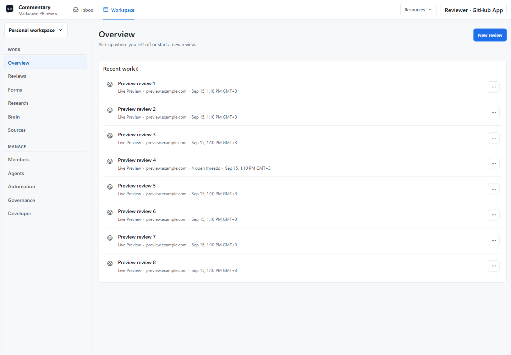
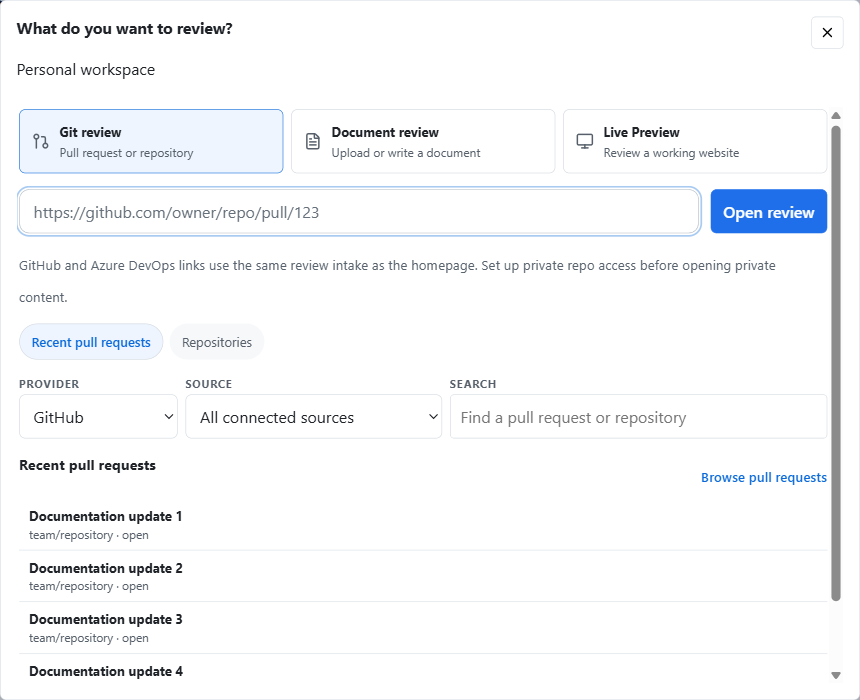

# Workspace

[Open Workspace](https://commentary.dev/workspace) to organize reviews, Forms, Research, Brain resources, and Sources in your selected personal or team workspace. Use the separate [Inbox](agent-inbox.md) destination for requests and updates across workspaces.

*Captured on commentary.dev on September 15, 2026. Account identity, review titles, and preview hostnames are replaced with neutral examples.*

## Personal And Team Workspaces

Your Commentary account has one durable personal workspace across browsers, devices, provider sessions, and API/MCP clients. GitHub installations and Azure DevOps connections are Sources, not additional workspace identities.

Use the workspace-name switcher to search the workspaces you belong to and see their Personal/Team kind and your role. `/workspace` returns to your most recently selected accessible workspace; a specific `/workspaces/{workspaceId}` link opens that workspace. If a saved selection is no longer accessible, Commentary recovers to your personal workspace. [Open Personal](https://commentary.dev/workspace?personal=1) is an explicit recovery shortcut.

Membership, agent grants, and Resource/Source permissions are separate. Joining a workspace or linking an item does not grant repository access.

## Work Sections

| Section | Use it for |
| --- | --- |
| Overview | Resume recent work or start a review. |
| Reviews | Find PR, repository-document, draft, Brainstorming, and Live Preview reviews. |
| Forms | Add source-backed Forms and reach preview, response links, submissions, and results. |
| Research | Create or continue studies; move to available results, including archived studies. |
| Brain | Find Knowledge Brain review work. |
| Sources | Inspect linked repositories and source material, and open related reviews. |

Collections provide search, applicable filters, ordering, and explicit continuation. **Clear filters** recovers from a filtered empty view. **Refresh results** restarts an expired page sequence while retaining the query and ordering. Partial or unavailable results expose recovery instead of claiming there are no matches.

From Sources, **View related reviews** filters Reviews to that repository. Remove the source chip to broaden the collection again. A row's **Link to workspace** action, when available, links the same Resource to another authorized workspace without copying its content. Rename is available for supported Commentary-owned resources.

## Start A Review

1. Select the workspace that should receive the review.
2. Choose **New review** from the page header.
3. Paste a GitHub or Azure DevOps URL, or browse recent pull requests and repositories. Narrow discovery by provider, source, and search.
4. For a repository, choose a PR or continue to its files and branches.
5. Alternatively, choose **Document review** to write/upload a draft, or **Live Preview** for a running website.

*Live chooser with repository names and PR titles anonymized.*

The selected workspace carries through creation and opening. Every new Resource receives an initial workspace link before creation succeeds. Later, an authorized **Link to workspace** action can associate it with another workspace.

Discovery checks current provider access. If a source cannot load, use its retry/recovery controls; incomplete discovery does not imply a missing repository. Creating a draft or Live Preview retains retry identity for an unchanged submission, allowing recovery from a lost response without creating another review.

## Manage Sections

- **Members:** membership, invitations, and roles.
- **Agents:** workspace agent inventory and permitted participation controls.
- **Automation:** routing, assignment, and attention-policy configuration.
- **Governance:** effective policy, privacy-preserving insights, and audit.
- **Developer:** workspace integrations, including [outbound webhooks](outbound-webhooks.md).

Controls depend on your role. See [Teams, agents, and automation](teams-and-agents.md) and [Enterprise governance](enterprise-governance.md).

Personal saved views, notification preferences, and API/OAuth credentials live in account settings. [Developer access](developer-access.md) remains owned by the connected account; selecting a team does not transfer or broaden those credentials.

## Provider Access And Recovery

GitHub discovery uses the connected GitHub App installation scope. Azure DevOps uses Microsoft Entra or the advanced PAT fallback. If content is missing, check the connected provider and repository permissions. Sources and collection links never override those checks.

Older `/workspace/...` links resolve through compatibility routes where supported. Prefer links from the current workspace for bookmarks and sharing context. Unavailable workspace pages offer safe Personal/Inbox recovery without exposing restricted workspace details.

Continue with [Draft reviews](draft-reviews.md), [Forms](commentary-forms.md), [Research Studies](research-studies.md), [Live Preview Reviews](web-app-reviews.md), or [Knowledge Brain](knowledge-brain.md).
